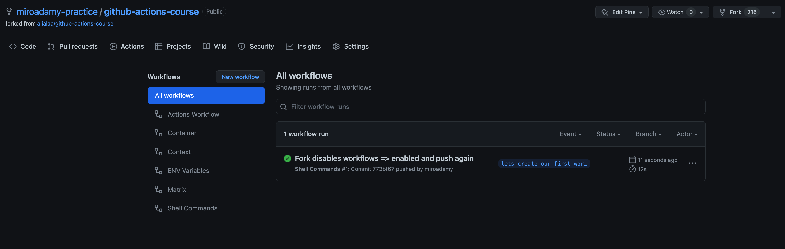
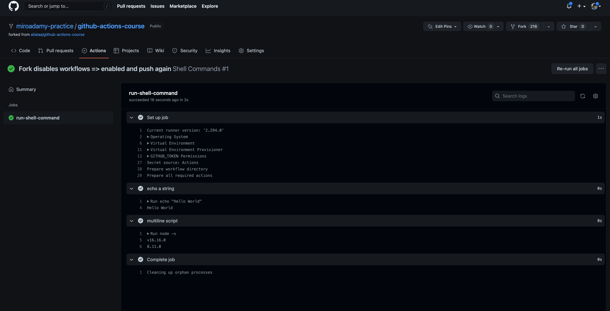

# Section 01 - Intro

## 01-1 Source

Repositories with code: 

* <https://github.com/miroadamy-practice/github-actions-course>
* This notes: <https://github.com/miroadamy-practice/notes-github-actions>
## 01-2 Basics

* reacts to events on repository or to reposotory (push, pull-request-open, pull-request-merged. schedule, external event)
* perform actions on events

Workflows runs in containers

Workflows - 1 or more jobs, each job - virtual machine

* VM can be Linux, Windows or Mac
* Job consists of steps (action or shell)
* jobs can be run in parallel
* can wait on finish TEST => (Build Linux, Build Mac)

Runner - any machine with GH App runner installed. It runs your jobs. It can be hosted on GH or by you

* GH hosted - maintained by GH, cannot customize HW [More information](https://docs.github.com/en/actions/using-github-hosted-runners/about-github-hosted-runners#supported-software)
* Self hosted - can control HW, must maintain

Types:

* ubuntu-latest or ubuntu-20.04, ubuntu-18.04, macos-12, macos-11 or macos-lastest, macos-10.15, windows-2019, windows-2022 or windows-latest 

**Hardware specification for Windows and Linux virtual machines:**

* 2-core CPU (x86_64)
* 7 GB of RAM
* 14 GB of SSD space

**Hardware specification for macOS virtual machines:**

* 3-core CPU (x86_64)
* 14 GB of RAM
* 14 GB of SSD space

Preinstalled software:

* curl, git, npm, yarn, pip
* python, ruby, nodeJS
* Android SDK and XCode
* see [ubuntu-20.04](https://github.com/actions/virtual-environments/blob/main/images/linux/Ubuntu2004-Readme.md)


## 01-3 YAML refresher

Like JSON only pythonic. Key-value pairs

Values can be string with or without ", cannot contain ':'

If value is object => indent with 2 or 4 spaces, TABS are not allowed

We can use JSON style objects in YAML - only without "

```
key: {key: value, key2: val2}
```

Arrays: starts with dash

```
array:
    - item1
    - item2 
    - item3isanObject:
        key1: val1
        key2: val2
    - item4
    - item5isanarray: [ one, two]
---
arrayOfObjects:
    - item1key1: val1
      item1key2: val2
    - item2key1: val21
      item2key2: val22
```

Continuation:

```
item1: val1
longItem: >
    all these lines
    will be joined
    together
    into one
nextItem: one
item3: |
    this will all be value of item3
    but endoflines will be preserved
```

Useful extensions:

* YAML to JSON - Visual Studio Marketplace: https://marketplace.visualstudio.com/items?itemName=ahebrank.yaml2json
* YAML - Visual Studio Marketplace: https://marketplace.visualstudio.com/items?itemName=redhat.vscode-yaml
* Prettier - Code formatter - Visual Studio Marketplace: https://marketplace.visualstudio.com/items?itemName=esbenp.prettier-vscode

## 01-4 First Workflow

See https://github.com/miroadamy-practice/github-actions-course

File `.github/workflows/simple.yml` - https://github.com/miroadamy-practice/github-actions-course/blob/lets-create-our-first-workflow/.github/workflows/simple.yml

```yaml
name: Shell Commands

on: [push]

jobs:
  run-shell-command:
    runs-on: ubuntu-latest
    steps: 
      - name: echo a string
        run: echo "Hello World"
      - name: multiline script 
        run: |
           node -v 
           npm -v
```

Run it: push into branch - https://github.com/miroadamy-practice/github-actions-course/commit/145b4f542d594995356ccc2dcc1328db52ac3c35

Fork disables workflows => enabled and push again


https://github.com/miroadamy-practice/github-actions-course/actions

https://github.com/miroadamy-practice/github-actions-course/runs/7703632123?check_suite_focus=true





Settings for Actions: Settings - https://github.com/miroadamy-practice/github-actions-course/settings/actions

Can get notifications - see https://github.com/settings/notifications

* email
* Web
* on all / failed

While job is running - can be cancelled and retried. You can re-run a workflow run, all failed jobs in a workflow run, or specific jobs in a workflow run up to 30 days after its initial run.

Action UI has search, download archive, show timestamps (the ...)

We can enable more information: session, secrets => `ACTIONS_RUNNER_DEBUG=true`, `ACTIONS_STEP_DEBUG=true`
https://docs.github.com/en/actions/managing-workflow-runs#enabling-debug-logging

## 01-5 Using different shells for each action

Shell list: https://docs.github.com/en/actions/using-workflows/workflow-syntax-for-github-actions#jobsjob_idstepsshell

Repo - https://github.com/miroadamy-practice/github-actions-course/tree/using-different-shells-for-each-step, branch `using-different-shells-for-each-step`

The workflow: https://github.com/miroadamy-practice/github-actions-course/blob/using-different-shells-for-each-step/.github/workflows/simple.yml

```yaml
name: Shell Commands 

on: [push]

jobs:
  run-shell-command:
    runs-on: ubuntu-latest
    steps: 
      - name: echo a string
        run: echo "Hello World"
      - name: multiline script 
        run: |
           node -v 
           npm -v
      - name: python Command 
        run: |
          import platform 
          print
          (platform.processor())
        shell: python
  run-windwos-commands:
    runs-on: windows-latest
    needs: ["run-shell-command"]
    steps:
      - name: Directory PowerShell
        run: Get-Location 
      - name: Directory Bash 
        run: pwd 
        shell: bash 
```

Note that:

* default shell == bash, supported on ALL
* to run different platform => needs new job
* jobs run in parallel by default, but we have `needs: ["run-shell-command"]` key


## 01-6 Using a simple action

See https://github.com/actions/hello-world-javascript-action

It is used in 

Example:

```
uses: actions/hello-world-javascript-action@main
with:
  who-to-greet: 'Mona the Octocat'
```

New workflow: 