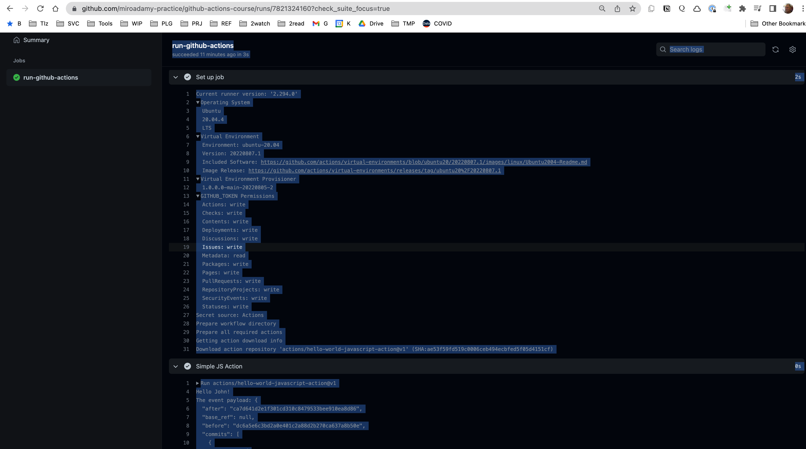

# Section 01 - Intro

## 01-01 Source

Repositories with code:

* <https://github.com/miroadamy-practice/github-actions-course>
* This notes: <https://github.com/miroadamy-practice/notes-github-actions>

## 01-02 Basics

* reacts to events on repository or to reposotory (push, pull-request-open, pull-request-merged. schedule, external event)
* perform actions on events

Workflows runs in containers

Workflows - 1 or more jobs, each job - virtual machine

* VM can be Linux, Windows or Mac
* Job consists of steps (action or shell)
* jobs can be run in parallel
* can wait on finish TEST => (Build Linux, Build Mac)

Runner - any machine with GH App runner installed. It runs your jobs. It can be hosted on GH or by you

* GH hosted - maintained by GH, cannot customize HW [More information](https://docs.github.com/en/actions/using-github-hosted-runners/about-github-hosted-runners#supported-software)
* Self hosted - can control HW, must maintain

Types:

* ubuntu-latest or ubuntu-20.04, ubuntu-18.04, macos-12, macos-11 or macos-lastest, macos-10.15, windows-2019, windows-2022 or windows-latest

**Hardware specification for Windows and Linux virtual machines:**

* 2-core CPU (x86_64)
* 7 GB of RAM
* 14 GB of SSD space

**Hardware specification for macOS virtual machines:**

* 3-core CPU (x86_64)
* 14 GB of RAM
* 14 GB of SSD space

Preinstalled software:

* curl, git, npm, yarn, pip
* python, ruby, nodeJS
* Android SDK and XCode
* see [ubuntu-20.04](https://github.com/actions/virtual-environments/blob/main/images/linux/Ubuntu2004-Readme.md)

## 01-03 YAML refresher

Like JSON only pythonic. Key-value pairs

Values can be string with or without ", cannot contain ':'

If value is object => indent with 2 or 4 spaces, TABS are not allowed

We can use JSON style objects in YAML - only without "

```yaml
key: {key: value, key2: val2}
```

Arrays: starts with dash

```yaml
array:
    - item1
    - item2 
    - item3isanObject:
        key1: val1
        key2: val2
    - item4
    - item5isanarray: [ one, two]
---
arrayOfObjects:
    - item1key1: val1
      item1key2: val2
    - item2key1: val21
      item2key2: val22
```

Continuation:

```yaml
item1: val1
longItem: >
    all these lines
    will be joined
    together
    into one
nextItem: one
item3: |
    this will all be value of item3
    but endoflines will be preserved
```

Useful extensions:

* YAML to JSON - Visual Studio Marketplace: <https://marketplace.visualstudio.com/items?itemName=ahebrank.yaml2json>
* YAML - Visual Studio Marketplace: <https://marketplace.visualstudio.com/items?itemName=redhat.vscode-yaml>
* Prettier - Code formatter - Visual Studio Marketplace: <https://marketplace.visualstudio.com/items?itemName=esbenp.prettier-vscode>

## 01-04 First Workflow

See <https://github.com/miroadamy-practice/github-actions-course>

File `.github/workflows/simple.yml` - <https://github.com/miroadamy-practice/github-actions-course/blob/lets-create-our-first-workflow/.github/workflows/simple.yml>

```yaml
name: Shell Commands

on: [push]

jobs:
  run-shell-command:
    runs-on: ubuntu-latest
    steps: 
      - name: echo a string
        run: echo "Hello World"
      - name: multiline script 
        run: |
           node -v 
           npm -v
```

Run it: push into branch - <https://github.com/miroadamy-practice/github-actions-course/commit/145b4f542d594995356ccc2dcc1328db52ac3c35>

Fork disables workflows => enabled and push again

<https://github.com/miroadamy-practice/github-actions-course/actions>

<https://github.com/miroadamy-practice/github-actions-course/runs/7703632123?check_suite_focus=true>


Settings for Actions: Settings - <https://github.com/miroadamy-practice/github-actions-course/settings/actions>

Can get notifications - see <https://github.com/settings/notifications>

* email
* Web
* on all / failed

While job is running - can be cancelled and retried. You can re-run a workflow run, all failed jobs in a workflow run, or specific jobs in a workflow run up to 30 days after its initial run.

Action UI has search, download archive, show timestamps (the ...)

We can enable more information: session, secrets => `ACTIONS_RUNNER_DEBUG=true`, `ACTIONS_STEP_DEBUG=true`
<https://docs.github.com/en/actions/managing-workflow-runs#enabling-debug-logging>

## 01-05 Using different shells for each action

Shell list: <https://docs.github.com/en/actions/using-workflows/workflow-syntax-for-github-actions#jobsjob_idstepsshell>

Repo - <https://github.com/miroadamy-practice/github-actions-course/tree/using-different-shells-for-each-step>, branch `using-different-shells-for-each-step`

The workflow: <https://github.com/miroadamy-practice/github-actions-course/blob/using-different-shells-for-each-step/.github/workflows/simple.yml>

```yaml
name: Shell Commands 

on: [push]

jobs:
  run-shell-command:
    runs-on: ubuntu-latest
    steps: 
      - name: echo a string
        run: echo "Hello World"
      - name: multiline script 
        run: |
           node -v 
           npm -v
      - name: python Command 
        run: |
          import platform 
          print
          (platform.processor())
        shell: python
  run-windwos-commands:
    runs-on: windows-latest
    needs: ["run-shell-command"]
    steps:
      - name: Directory PowerShell
        run: Get-Location 
      - name: Directory Bash 
        run: pwd 
        shell: bash 
```

Note that:

* default shell == bash, supported on ALL
* to run different platform => needs new job
* jobs run in parallel by default, but we have `needs: ["run-shell-command"]` key

## 01-06 Using a simple action

See <https://github.com/actions/hello-world-javascript-action>

It is used in <https://github.com/miroadamy-practice/github-actions-course/blob/using-a-simple-action/.github/workflows/actions.yml>
(example of multiple workflows)

Example:

```yaml
uses: actions/hello-world-javascript-action@main
with:
  who-to-greet: 'Mona the Octocat'
```

Note `uses` instead of `run` + reference to an action.

It can be local (`./ path`) or public repository - action/hello-world-javascript-action@main

After @ either branch or version or commit (SHA1). Best practice => use version. The @v1 => latest of v1, e.g. v1.2.5

Actions are written in Javascript

This action takes input. => `with` keyword

Push triggered ALL workflow: simple.yml and action.yml => <https://github.com/miroadamy-practice/github-actions-course/runs/7821324161?check_suite_focus=true>

The action output is VERY verbose => <https://github.com/miroadamy-practice/github-actions-course/runs/7821324160?check_suite_focus=true>

```sh
run-github-actions
succeeded 10 minutes ago in 3s
Search logs
2s
Current runner version: '2.294.0'
Operating System
  Ubuntu
  20.04.4
  LTS
Virtual Environment
  Environment: ubuntu-20.04
  Version: 20220807.1
  Included Software: https://github.com/actions/virtual-environments/blob/ubuntu20/20220807.1/images/linux/Ubuntu2004-Readme.md
  Image Release: https://github.com/actions/virtual-environments/releases/tag/ubuntu20%2F20220807.1
Virtual Environment Provisioner
  1.0.0.0-main-20220805-2
GITHUB_TOKEN Permissions
  Actions: write
  Checks: write
  Contents: write
  Deployments: write
  Discussions: write
  Issues: write
  Metadata: read
  Packages: write
  Pages: write
  PullRequests: write
  RepositoryProjects: write
  SecurityEvents: write
  Statuses: write
Secret source: Actions
Prepare workflow directory
Prepare all required actions
Getting action download info
Download action repository 'actions/hello-world-javascript-action@v1' (SHA:ae53f59fd519c0006ceb494ecbfed5f05d4151cf)
0s
Run actions/hello-world-javascript-action@v1
Hello John!
The event payload: {
  "after": "ca7d641d2e1f301cd310c8479533bee910ea8d86",
  "base_ref": null,
  "before": "dc6a5e6c3bd2a0e401c2a88d2b270ca637a8b50e",
  "commits": [
    {
      "author": {
        "email": "miro.adamy@gmail.com",
        "name": "Miro Adamy",
        "username": "miroadamy"
      },
      "committer": {
        "email": "miro.adamy@gmail.com",
        "name": "Miro Adamy",
        "username": "miroadamy"
      },
      "distinct": true,
      "id": "ca7d641d2e1f301cd310c8479533bee910ea8d86",
      "message": "Trigger push",
      "timestamp": "2022-08-13T19:11:14Z",
      "tree_id": "d90800085f5aec89a2966bbea7e43b1fa8540a72",
      "url": "https://github.com/miroadamy-practice/github-actions-course/commit/ca7d641d2e1f301cd310c8479533bee910ea8d86"
    }
  ],
  "compare": "https://github.com/miroadamy-practice/github-actions-course/compare/dc6a5e6c3bd2...ca7d641d2e1f",
  "created": false,
  "deleted": false,
  "forced": false,
  "head_commit": {
    "author": {
      "email": "miro.adamy@gmail.com",
      "name": "Miro Adamy",
      "username": "miroadamy"
    },
    "committer": {
      "email": "miro.adamy@gmail.com",
      "name": "Miro Adamy",
      "username": "miroadamy"
    },
    "distinct": true,
    "id": "ca7d641d2e1f301cd310c8479533bee910ea8d86",
    "message": "Trigger push",
    "timestamp": "2022-08-13T19:11:14Z",
    "tree_id": "d90800085f5aec89a2966bbea7e43b1fa8540a72",
    "url": "https://github.com/miroadamy-practice/github-actions-course/commit/ca7d641d2e1f301cd310c8479533bee910ea8d86"
  },
  "organization": {
    "avatar_url": "https://avatars.githubusercontent.com/u/96669309?v=4",
    "description": null,
    "events_url": "https://api.github.com/orgs/miroadamy-practice/events",
    "hooks_url": "https://api.github.com/orgs/miroadamy-practice/hooks",
    "id": 96669309,
    "issues_url": "https://api.github.com/orgs/miroadamy-practice/issues",
    "login": "miroadamy-practice",
    "members_url": "https://api.github.com/orgs/miroadamy-practice/members{/member}",
    "node_id": "O_kgDOBcMOfQ",
    "public_members_url": "https://api.github.com/orgs/miroadamy-practice/public_members{/member}",
    "repos_url": "https://api.github.com/orgs/miroadamy-practice/repos",
    "url": "https://api.github.com/orgs/miroadamy-practice"
  },
  "pusher": {
    "email": "miro.adamy@gmail.com",
    "name": "miroadamy"
  },
  "ref": "refs/heads/using-a-simple-action",
  "repository": {
    "allow_forking": true,
    "archive_url": "https://api.github.com/repos/miroadamy-practice/github-actions-course/{archive_format}{/ref}",
    "archived": false,
    "assignees_url": "https://api.github.com/repos/miroadamy-practice/github-actions-course/assignees{/user}",
    "blobs_url": "https://api.github.com/repos/miroadamy-practice/github-actions-course/git/blobs{/sha}",
    "branches_url": "https://api.github.com/repos/miroadamy-practice/github-actions-course/branches{/branch}",
    "clone_url": "https://github.com/miroadamy-practice/github-actions-course.git",
    "collaborators_url": "https://api.github.com/repos/miroadamy-practice/github-actions-course/collaborators{/collaborator}",
    "comments_url": "https://api.github.com/repos/miroadamy-practice/github-actions-course/comments{/number}",
    "commits_url": "https://api.github.com/repos/miroadamy-practice/github-actions-course/commits{/sha}",
    "compare_url": "https://api.github.com/repos/miroadamy-practice/github-actions-course/compare/{base}...{head}",
    "contents_url": "https://api.github.com/repos/miroadamy-practice/github-actions-course/contents/{+path}",
    "contributors_url": "https://api.github.com/repos/miroadamy-practice/github-actions-course/contributors",
    "created_at": 1659729820,
    "default_branch": "master",
    "deployments_url": "https://api.github.com/repos/miroadamy-practice/github-actions-course/deployments",
    "description": null,
    "disabled": false,
    "downloads_url": "https://api.github.com/repos/miroadamy-practice/github-actions-course/downloads",
    "events_url": "https://api.github.com/repos/miroadamy-practice/github-actions-course/events",
    "fork": true,
    "forks": 0,
    "forks_count": 0,
    "forks_url": "https://api.github.com/repos/miroadamy-practice/github-actions-course/forks",
    "full_name": "miroadamy-practice/github-actions-course",
    "git_commits_url": "https://api.github.com/repos/miroadamy-practice/github-actions-course/git/commits{/sha}",
    "git_refs_url": "https://api.github.com/repos/miroadamy-practice/github-actions-course/git/refs{/sha}",
    "git_tags_url": "https://api.github.com/repos/miroadamy-practice/github-actions-course/git/tags{/sha}",
    "git_url": "git://github.com/miroadamy-practice/github-actions-course.git",
    "has_downloads": true,
    "has_issues": false,
    "has_pages": false,
    "has_projects": true,
    "has_wiki": true,
    "homepage": null,
    "hooks_url": "https://api.github.com/repos/miroadamy-practice/github-actions-course/hooks",
    "html_url": "https://github.com/miroadamy-practice/github-actions-course",
    "id": 521762712,
    "is_template": false,
    "issue_comment_url": "https://api.github.com/repos/miroadamy-practice/github-actions-course/issues/comments{/number}",
    "issue_events_url": "https://api.github.com/repos/miroadamy-practice/github-actions-course/issues/events{/number}",
    "issues_url": "https://api.github.com/repos/miroadamy-practice/github-actions-course/issues{/number}",
    "keys_url": "https://api.github.com/repos/miroadamy-practice/github-actions-course/keys{/key_id}",
    "labels_url": "https://api.github.com/repos/miroadamy-practice/github-actions-course/labels{/name}",
    "language": null,
    "languages_url": "https://api.github.com/repos/miroadamy-practice/github-actions-course/languages",
    "license": null,
    "master_branch": "master",
    "merges_url": "https://api.github.com/repos/miroadamy-practice/github-actions-course/merges",
    "milestones_url": "https://api.github.com/repos/miroadamy-practice/github-actions-course/milestones{/number}",
    "mirror_url": null,
    "name": "github-actions-course",
    "node_id": "R_kgDOHxl3mA",
    "notifications_url": "https://api.github.com/repos/miroadamy-practice/github-actions-course/notifications{?since,all,participating}",
    "open_issues": 0,
    "open_issues_count": 0,
    "organization": "miroadamy-practice",
    "owner": {
      "avatar_url": "https://avatars.githubusercontent.com/u/96669309?v=4",
      "email": null,
      "events_url": "https://api.github.com/users/miroadamy-practice/events{/privacy}",
      "followers_url": "https://api.github.com/users/miroadamy-practice/followers",
      "following_url": "https://api.github.com/users/miroadamy-practice/following{/other_user}",
      "gists_url": "https://api.github.com/users/miroadamy-practice/gists{/gist_id}",
      "gravatar_id": "",
      "html_url": "https://github.com/miroadamy-practice",
      "id": 96669309,
      "login": "miroadamy-practice",
      "name": "miroadamy-practice",
      "node_id": "O_kgDOBcMOfQ",
      "organizations_url": "https://api.github.com/users/miroadamy-practice/orgs",
      "received_events_url": "https://api.github.com/users/miroadamy-practice/received_events",
      "repos_url": "https://api.github.com/users/miroadamy-practice/repos",
      "site_admin": false,
      "starred_url": "https://api.github.com/users/miroadamy-practice/starred{/owner}{/repo}",
      "subscriptions_url": "https://api.github.com/users/miroadamy-practice/subscriptions",
      "type": "Organization",
      "url": "https://api.github.com/users/miroadamy-practice"
    },
    "private": false,
    "pulls_url": "https://api.github.com/repos/miroadamy-practice/github-actions-course/pulls{/number}",
    "pushed_at": 1660417878,
    "releases_url": "https://api.github.com/repos/miroadamy-practice/github-actions-course/releases{/id}",
    "size": 22,
    "ssh_url": "git@github.com:miroadamy-practice/github-actions-course.git",
    "stargazers": 0,
    "stargazers_count": 0,
    "stargazers_url": "https://api.github.com/repos/miroadamy-practice/github-actions-course/stargazers",
    "statuses_url": "https://api.github.com/repos/miroadamy-practice/github-actions-course/statuses/{sha}",
    "subscribers_url": "https://api.github.com/repos/miroadamy-practice/github-actions-course/subscribers",
    "subscription_url": "https://api.github.com/repos/miroadamy-practice/github-actions-course/subscription",
    "svn_url": "https://github.com/miroadamy-practice/github-actions-course",
    "tags_url": "https://api.github.com/repos/miroadamy-practice/github-actions-course/tags",
    "teams_url": "https://api.github.com/repos/miroadamy-practice/github-actions-course/teams",
    "topics": [],
    "trees_url": "https://api.github.com/repos/miroadamy-practice/github-actions-course/git/trees{/sha}",
    "updated_at": "2022-08-03T08:10:16Z",
    "url": "https://github.com/miroadamy-practice/github-actions-course",
    "visibility": "public",
    "watchers": 0,
    "watchers_count": 0,
    "web_commit_signoff_required": false
  },
  "sender": {
    "avatar_url": "https://avatars.githubusercontent.com/u/461826?v=4",
    "events_url": "https://api.github.com/users/miroadamy/events{/privacy}",
    "followers_url": "https://api.github.com/users/miroadamy/followers",
    "following_url": "https://api.github.com/users/miroadamy/following{/other_user}",
    "gists_url": "https://api.github.com/users/miroadamy/gists{/gist_id}",
    "gravatar_id": "",
    "html_url": "https://github.com/miroadamy",
    "id": 461826,
    "login": "miroadamy",
    "node_id": "MDQ6VXNlcjQ2MTgyNg==",
    "organizations_url": "https://api.github.com/users/miroadamy/orgs",
    "received_events_url": "https://api.github.com/users/miroadamy/received_events",
    "repos_url": "https://api.github.com/users/miroadamy/repos",
    "site_admin": false,
    "starred_url": "https://api.github.com/users/miroadamy/starred{/owner}{/repo}",
    "subscriptions_url": "https://api.github.com/users/miroadamy/subscriptions",
    "type": "User",
    "url": "https://api.github.com/users/miroadamy"
  }
}
0s
Run echo "19:11:29 GMT+0000 (Coordinated Universal Time)"
  echo "19:11:29 GMT+0000 (Coordinated Universal Time)"
  shell: /usr/bin/bash -e {0}
19:11:29 GMT+0000 (Coordinated Universal Time)
0s
Cleaning up orphan processes
```



The action can produce output - we add seconds step that refers the previous step named output. See `output` section of <https://github.com/actions/hello-world-javascript-action>

```yaml

 - name: Log Greeting Time
        run: echo "${{ steps.greet.outputs.time }}"

```

The action step needs id to be referred to.

This is the action, btw:

```js
const core = require('@actions/core');
const github = require('@actions/github');

try {
  // `who-to-greet` input defined in action metadata file
  const nameToGreet = core.getInput('who-to-greet');
  console.log(`Hello ${nameToGreet}!`);
  const time = (new Date()).toTimeString();
  core.setOutput("time", time);
  // Get the JSON webhook payload for the event that triggered the workflow
  const payload = JSON.stringify(github.context.payload, undefined, 2)
  console.log(`The event payload: ${payload}`);
} catch (error) {
  core.setFailed(error.message);
}
```

It is actually action that logs all that.

## 01-07 The Checkout Action

Where does the code run ?

See `the-checkout-action` branch - <https://github.com/miroadamy-practice/github-actions-course/blob/the-checkout-action/.github/workflows/actions.yml>

```yaml

jobs: 
  run-github-actions: 
    runs-on: ubuntu-latest
    steps:
      - name: List Files 
        run: |
          pwd
          ls -a
          echo $GITHUB_SHA
          echo $GITHUB_REPOSITORY
          echo $GITHUB_WORKSPACE
          echo "${{ github.token }}"
          # git clone git@github:$GITHUB_REPOSITORY
          # git checkout $GITHUB_SHA
      - name: Checkout 
        uses: actions/checkout@v1
      - name: List Files After Checkout
        run: |
          pwd
          ls -a
      - name: Simple JS Action
        id: greet 
        uses: actions/hello-world-javascript-action@v1
        with: 
          who-to-greet: John
      - name: Log Greeting Time
        run: echo "${{ steps.greet.outputs.time }}"

```

The results of the first:

```sh

  pwd
  ls -a
  echo $GITHUB_SHA
  echo $GITHUB_REPOSITORY
  echo $GITHUB_WORKSPACE
  echo "***" # this was github.token 
  # git clone git@github:$GITHUB_REPOSITORY
  # git checkout $GITHUB_SHA
  shell: /usr/bin/bash -e {0}
---
/home/runner/work/github-actions-course/github-actions-course
.
..
3a1ab11f8dc8a055ea9352d967d9707df100fdf5
miroadamy-practice/github-actions-course
/home/runner/work/github-actions-course/github-actions-course
***

```

Note that the workspace is empty. By default workflow does NOT clone

=> action `actions/checkout` => <https://github.com/actions/checkout>, <https://github.com/marketplace/actions/checkout@v1>

Files after checkout:

```yaml
  pwd
  ls -a
  shell: /usr/bin/bash -e {0}
---
/home/runner/work/github-actions-course/github-actions-course
.
..
.git
.github
README.md
test.yml
```

ENV Variables set automatically:

* $GITHUB_SHA => the commit id that triggered
* $GITHUB_REPOSITORY
* $GITHUB_REPOSITORY
* github.token => does not display
