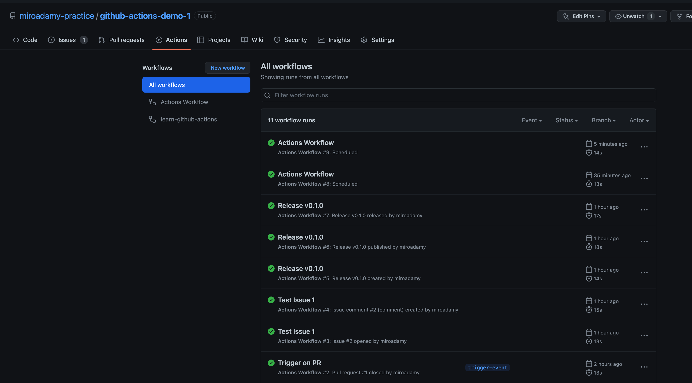
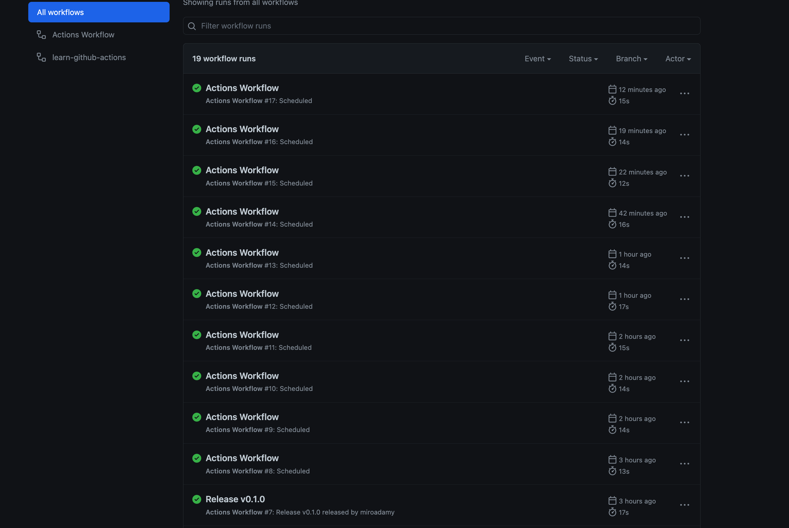

# Section 02 - Events, Schedulers, Filters

## 02-09 Events

Events, Schedules, External Events & Filters that can Trigger a Workflow Run

Any type of event can trigger: <https://docs.github.com/en/actions/using-workflows/events-that-trigger-workflows>
On pull_request - checks will run, and all actions

By default - runs only on open, synchronize and reopen of pull_request, not on close.

Push has no `activity_type`

Specifying activity type:

```yaml
on: 
  push:
  pull_request:
    types: [closed, assigned, opened, reopened]

```

See <https://github.com/miroadamy-practice/github-actions-course/tree/triggering-a-workflow-with-github-events-and-activity-types>

NOTE: When working with forks, this defaults to origin

See <https://github.com/miroadamy-practice/github-actions-demo-1>

* Created PR: <https://github.com/miroadamy-practice/github-actions-demo-1/runs/7825414205?check_suite_focus=true>
* Closed: <https://github.com/miroadamy-practice/github-actions-demo-1/actions/runs/2855222060>

Note that the checkout for PR gets the proper commit:

```sh
git checkout --progress --force 6ce550e507e4726b14ac239f5b2eff804b620884
Note: switching to '6ce550e507e4726b14ac239f5b2eff804b620884'.

```

PR related terminology:

Base Branch: The "Base Branch" is the branch where your new changes should be applied / integrated into. (target)

Head Branch: The "Head Branch" is the branch that contains the changes you want to integrate.

Triggering WF when PR is targeting `release`. BOTH conditions must be satisfied - must include js file for `release/` branch

```yaml
on:
  pull_request:
    types:
      - opened
    branches:
      - 'releases/**'
    paths:
      - '**.js'
```

To run a job based on the pull request's head branch name (as opposed to the pull request's base branch name), use the github.head_ref context in a conditional. For example, this workflow will run whenever a pull request is opened, but the run_if job will only execute if the head of the pull request is a branch whose name starts with releases/:

```yaml
on:
  pull_request:
    types:
      - opened
jobs:
  run_if:
    if:  startsWith(github.head_ref, 'releases/')
    runs-on: ubuntu-latest
    steps:
      - run: echo "The head of this PR starts with 'releases/'"
```

More: <https://docs.github.com/en/actions/using-workflows/events-that-trigger-workflows#pull_request>

Experiments with triggers:

```yaml
on: 
  pull_request:
    types: [closed, assigned, opened, reopened]
  issues:
  issue_comment:
    types: [created, deleted]
  label:
    types: [created, deleted]
  release:
  
```

See <https://github.com/miroadamy-practice/github-actions-demo-1>

The Simple JS action shows payload dependent on the trigger:

* PR opened: - <https://github.com/miroadamy-practice/github-actions-demo-1/runs/7825414205?check_suite_focus=true#step:5:6>
* issue - <https://github.com/miroadamy-practice/github-actions-demo-1/runs/7825792828?check_suite_focus=true#step:5:7>
* comment - <https://github.com/miroadamy-practice/github-actions-demo-1/runs/7825805192?check_suite_focus=true#step:5:7>
* release - triggered 3x, created, published, released

## 02-10 Scheduled triggers

* <https://crontab.guru/>
* <https://crontab.guru/examples.html>

Example is here: <https://github.com/miroadamy-practice/github-actions-course/blob/setting-a-schedule-to-trigger-workflows/.github/workflows/actions.yml>

```yaml
on:
  schedule:
    - cron: "0/5 * * * *"
    - cron: "0/6 * * * *" 
```

Schedule is array of cron expression3:

`MINUTE HOUR DAY-OF-MONTH MONTH DAY-OF-WEEK`

NOTE: The above - `"0/5 * * * *"` never triggered (used without quotes)

I changed it to `"*/5 * * * *"`

Scheduled event payload is very small:

```json
The event payload: {
  "schedule": "0/5 * * * *"
}
```

Changed back to `"0/5 * * * *"` => never runs

Changed to `"*/5 * * * *"` to check:

See also:
    * <https://docs.github.com/en/free-pro-team@latest/actions/reference/events-that-trigger-workflows#scheduled-events>

### Issues with Cron

This can be coincidence, but:




Changed to '*/15' and '0/20' to let run over period of time

It can be coincidence - GH is slow

Update - 2 hours later:

It seems to have restarted on its own:



Will disabling the schedule soon

### More on Schedule

Also:

* All times in schedule are UTC times
* We can use JAN, FEB instead of month number
* Days of week ==> 0 = Sunday, 6 = Saturday, can use SUN, MON
* sched must be on main branch

## 02-11 Manual triggers

Event `repository_dispatch`

POST request - see <https://docs.github.com/en/rest/repos/repos#create-a-repository-dispatch-event>

```sh
curl \
  -X POST \
  -H "Accept: application/vnd.github+json" \ 
  -H "Authorization: token $GH_TOKEN" \
  https://api.github.com/repos/miroadamy-practice/github-actions-demo-1/dispatches \
  -d '{"event_type":"on-demand-test","client_payload":{"unit":false,"integration":true}}'
```

```js
// Octokit.js
// https://github.com/octokit/core.js#readme
const octokit = new Octokit({
  auth: 'personal-access-token123'
})

await octokit.request('POST /repos/{owner}/{repo}/dispatches', {
  owner: 'OWNER',
  repo: 'REPO',
  event_type: 'on-demand-test',
  client_payload: {
    unit: false,
    integration: true
  }
})
```

if we specify type, we need to match the type in the event type

Need to generate new token, should be enough to generate repo scope

Use Rest Client - rest.http

```json
## Trigger workflow
POST https://api.github.com/repos/miroadamy-practice/github-actions-demo-1/dispatches
Content-Type:  application/vnd.github+json" \ 
Authorization: token {{ghtoken}}

{"event_type":"on_demand_test","client_payload":{"unit":false,"integration":true}}

---
The event payload: {
  "action": "on_demand_test",
  "branch": "main",
  "client_payload": {
    "integration": true,
    "unit": false
  },
```

The tokens are defined in the `.vscode/settings.json`

## 02-12

zz