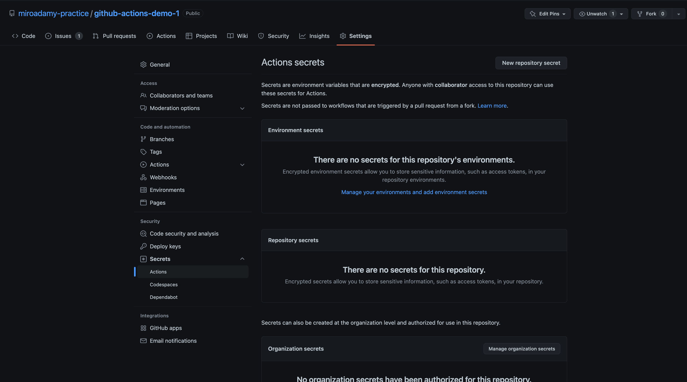

# Section 03 - Env variables, Encryption

Environment variables, encryption, expressions and context

## 03-13 Default and custom environment variables

See <https://github.com/miroadamy-practice/github-actions-course/tree/default-and-custom-environment-variables>

Docs: <https://docs.github.com/en/actions/learn-github-actions/environment-variables>

```yaml
name: ENV Variables 
on: push 
env: 
  WF_ENV: Available to all jobs 

jobs: 
  log-env:
    runs-on: ubuntu-latest
    env:
      JOB_ENV: Available to all steps in log-env jobs
    steps:
      - name: Log ENV Variables 
        env: 
          STEP_ENV: Available to only this step 
        run: |
          echo "WF_ENV: ${WF_ENV}"
          echo "JOB_ENV: ${JOB_ENV}"
          echo "STEP_ENV: ${STEP_ENV}"
  log-default-env: 
    runs-on: ubuntu-latest
    steps:
      - name: Default ENV Variables 
        run: |
          echo "HOME: ${HOME}"
          echo "GITHUB_WORKFLOW: ${GITHUB_WORKFLOW}"
          echo "GITHUB_ACTION: ${GITHUB_ACTION}"
          echo "GITHUB_ACTIONS: ${GITHUB_ACTIONS}"
          echo "GITHUB_ACTOR: ${GITHUB_ACTOR}"
          echo "GITHUB_REPOSITORY: ${GITHUB_REPOSITORY}"
          echo "GITHUB_EVENT_NAME: ${GITHUB_EVENT_NAME}"
          echo "GITHUB_WORKSPACE: ${GITHUB_WORKSPACE}"
          echo "GITHUB_SHA: ${GITHUB_SHA}"
          echo "GITHUB_REF: ${GITHUB_REF}"
          echo "WF_ENV: ${WF_ENV}"
          echo "JOB_ENV: ${JOB_ENV}"
          echo "STEP_ENV: ${STEP_ENV}"
```

Each level can have `env:` key

Output:

```sh
WF_ENV: Available to all jobs
JOB_ENV: Available to all steps in log-env jobs
STEP_ENV: Available to only this step
---
HOME: /home/runner
GITHUB_WORKFLOW: ENV Variables
GITHUB_ACTION: __run
GITHUB_ACTIONS: true
GITHUB_ACTOR: miroadamy
GITHUB_REPOSITORY: miroadamy-practice/github-actions-demo-1
GITHUB_EVENT_NAME: push
GITHUB_WORKSPACE: /home/runner/work/github-actions-demo-1/github-actions-demo-1
GITHUB_SHA: ec152435ccb1d4b3cb52c14fcb4f5ebb4688e587
GITHUB_REF: refs/heads/chapter/03-13
WF_ENV: Available to all jobs
JOB_ENV: 
STEP_ENV: 
```

GITHUB action - name of the step, if multiple - uses run1, run2 etc

## 03-14 Encrypting variables

Go to User Profile settings, secrets

I have defined secret at repo level but any attempt to print it fails (feature)



See the hacks around it: <https://github.com/miroadamy-practice/github-actions-demo-1/runs/7838712995?check_suite_focus=true>

Special secret - can be used directly without creating it

```sh

${{ secrets.GITHUB_TOKEN }}


```

## 03-15 Using GITHUB_TOKEN

At the start of each workflow run, GitHub automatically creates a unique GITHUB_TOKEN secret to use in your workflow. You can use the GITHUB_TOKEN to authenticate in a workflow run.

When you enable GitHub Actions, GitHub installs a GitHub App on your repository. The GITHUB_TOKEN secret is a GitHub App installation access token. You can use the installation access token to authenticate on behalf of the GitHub App installed on your repository. The token's permissions are limited to the repository that contains your workflow.

Use case: Use Github action that does something with repo and needs authentication

Docs: <https://docs.github.com/en/actions/security-guides/automatic-token-authentication>


```yaml
name: Pull request labeler
on: [ pull_request_target ]

permissions:
  contents: read
  pull-requests: write

jobs:
  triage:
    runs-on: ubuntu-latest
    steps:
      - uses: actions/labeler@v4
        with:
          repo-token: ${{ secrets.GITHUB_TOKEN }}
```

```yaml
name: Create issue on commit

on: [ push ]

jobs:
  create_issue:
    runs-on: ubuntu-latest
    permissions:
      issues: write 
    steps:
      - name: Create issue using REST API
        run: |
          curl --request POST \
          --url https://api.github.com/repos/${{ github.repository }}/issues \
          --header 'authorization: Bearer ${{ secrets.GITHUB_TOKEN }}' \
          --header 'content-type: application/json' \
          --data '{
            "title": "Automated issue for commit: ${{ github.sha }}",
            "body": "This issue was automatically created by the GitHub Action workflow **${{ github.workflow }}**. \n\n The commit hash was: _${{ github.sha }}_."
            }' \
          --fail
```
This is in https://github.com/miroadamy-practice/github-actions-demo-1/commit/1f68498caa44ccffd12c8d205d4061b3b5ca14dc (must be in main branch to be target of the dispatch)

Note - https://github.com/miroadamy-practice/github-actions-demo-1/issues/4

Also - used to modify repo

Should use https based URLS - see <https://github.com/miroadamy-practice/github-actions-course/tree/using-the-github-token-secret-for-authentication>

```yaml
jobs: 
  create_issue:
    runs-on: ubuntu-latest
    steps:
      - name: Push a random file
        run: |
          pwd 
          ls -a 
          git init
          git remote add origin "https://$GITHUB_ACTOR:${{ secrets.GITHUB_TOKEN }}@github.com/$GITHUB_REPOSITORY.git"
          git config --global user.email "my-bot@bot.com"
          git config --global user.name "my-bot"
          git fetch
          git checkout master
          git branch --set-upstream-to=origin/master
          git pull
          ls -a
          echo $RANDOM >> random.txt
          ls -a 
          git add -A
          git commit -m"Random file"
          git push

```

Test in https://github.com/miroadamy-practice/github-actions-demo-1/tree/d26aad05dbdb91a4669167f43d322f08ae9f1f83

```sh
### Update repo

POST https://api.github.com/repos/miroadamy-practice/github-actions-demo-1/dispatches
Content-Type:  application/vnd.github+json" \ 
Authorization: token {{ghtoken}}

{"event_type":"modify_repo","client_payload":{"unit":false,"integration":true, "env": "production"}}

```

See the commit: https://github.com/miroadamy-practice/github-actions-demo-1/commit/1b7a3a91fcd6b371d4f8edb460472acac57f2ee3

There is most likely ready to use action for this
## 03-16 Encrypting and decrypting files

## 03-17 Expressions and contexts

## 03-18 Using Functions in Expressions

## 03-19 The If key && job status function
