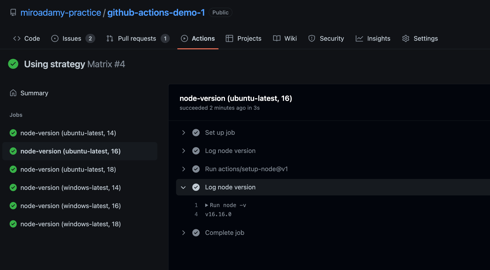

# 04 Using Strategy, Matrix and Docker

How to use Strategy, Matrix and Docker Container in jobs

## 04-20 Continue on error + timeout

Keyword `[needs]` => waits for results of other job

Run even if all fails `continue_on_error`

`timeout-minutes`: 360 (default),

No demo. Check [docs](https://docs.github.com/en/actions/using-workflows/workflow-syntax-for-github-actions#jobsjob_idstepscontinue-on-error)

## 04-21 Using setup-node action

See [docs](https://github.com/actions/setup-node)

Demo repo: <https://github.com/miroadamy-practice/github-actions-course/blob/using-the-setup-node-action/.github/workflows/matrix.yml>

My test repo: <https://github.com/miroadamy-practice/github-actions-demo-1/blob/chapter/04-20/.github/workflows/matrix.yml>

Use case: running with different Node JS versions.

```yml
name: Matrix 
on: 
  push:
    branches:
      - chapter/04-20

jobs: 
  node-version:
    runs-on: ubuntu-latest
    steps: 
      - name: Log node version 
        run: node -v
      - uses: actions/setup-node@v3
        with:
          node-version: 14
      - name: Log node version 
        run: node -v
```

See <https://github.com/miroadamy-practice/github-actions-demo-1/runs/7865521546?check_suite_focus=true>

## 04-22 Creating a Matrix for Running a Job with Different Environments

Use case - needs to test multiple versions

Demo repo: <https://github.com/miroadamy-practice/github-actions-course/blob/creating-a-matrix-for-running-a-job-with-different-environments/.github/workflows/matrix.yml>

Use new job-level markup:

```yaml

name: Matrix 
on: push 

jobs: 
  node-version:
    strategy: 
      matrix:
        os: [ubuntu-latest, windows-latest] 
        node_version: [14, 16, 18]
    runs-on: ${{ matrix.os }}
    steps: 
      - name: Log node version 
        run: node -v
      - uses: actions/setup-node@v1
        with:
          node-version: ${{ matrix.node_version }}
      - name: Log node version 
        run: node -v


```

Optional -

* `fail-fast: true`
* `max-parallel: 2` (by default maximizes)



## 04-23 Including & Excluding Matrix Configurations

Exclude certain configs

```yaml
        exclude:
          - os: windows-latest
            node_version:  16
          - os: windows-latest
            node_version: 14
```

NOTE: Include is different, it adds extra variable to a config

```yaml

name: Matrix 
on: 
  push:
    branches:
      - chapter/04-20

jobs: 
  node-version:
    strategy: 
      matrix:
        os: [ubuntu-latest, windows-latest] 
        node_version: [14, 16, 18]
        exclude:
          - os: windows-latest
            node_version:  16
          - os: windows-latest
            node_version: 14
        include:
          - os: ubuntu-latest
            node_version: 16
            is_ubuntu_16: "yesss!"

    runs-on: ${{ matrix.os }}
    env: 
      IS_UBUNTU_16: ${{ matrix.is_ubuntu_16}}
    steps: 
      - name: Log node version 
        run: node -v
      - uses: actions/setup-node@v3
        with:
          node-version: ${{ matrix.node_version }}
      - name: Log node version 
        run: |
          node -v
          echo "Included = $IS_UBUNTU_16"
      - name: Dump GitHub context
        id: github_context_step
        run: echo '${{ toJSON(github) }}'
      - name: Dump job context
        run: echo '${{ toJSON(job) }}'
      - name: Dump steps context
        run: echo '${{ toJSON(steps) }}'
      - name: Dump runner context
        run: echo '${{ toJSON(runner) }}'
      - name: Dump strategy context
        run: echo '${{ toJSON(strategy) }}'
      - name: Dump matrix context
        run: echo '${{ toJSON(matrix) }}'

```

See <https://github.com/miroadamy-practice/github-actions-demo-1/actions/runs/2870690213>

Matrix context for 14 and 16:

```json
v14.20.0
Included = 
...
{
  "os": "ubuntu-latest",
  "node_version": 14
}
---
v16.16.0
Included = yesss!
...
{
  "os": "ubuntu-latest",
  "node_version": 16,
  "is_ubuntu_16": "yesss!"
}
```

## 04-24 Using Docker Containers in Jobs

See <https://github.com/miroadamy-practice/github-actions-course/blob/using-docker-containers-in-jobs/.github/workflows/container.yml>

In addition to ubuntu-latest, specify container

```yaml
name: Container

on:
  push:
    branches:
      - chapter/04-24

jobs:
  node-docker:
    runs-on: ubuntu-latest
    container: 
      image: node:16.16.0-alpine3.16
    steps:
      - name: Log node version  
        run: |
          node -v
          cat /etc/os-release

```

There is new section: initialize-container - <https://github.com/miroadamy-practice/github-actions-demo-1/runs/7866390271?check_suite_focus=true>

```txt
2s
Checking docker version
  /usr/bin/docker version --format '{{.Server.APIVersion}}'
  '1.41'
  Docker daemon API version: '1.41'
  /usr/bin/docker version --format '{{.Client.APIVersion}}'
  '1.41'
  Docker client API version: '1.41'
Clean up resources from previous jobs
  /usr/bin/docker ps --all --quiet --no-trunc --filter "label=94859b"
  /usr/bin/docker network prune --force --filter "label=94859b"
Create local container network
  /usr/bin/docker network create --label 94859b github_network_1f31a49f8c984efa9b3ec4f19b812cf3
  ee4f49c990ea66488b4f28bd9cd2118b9452f19b78b74dfb8da98628a83ab1a2
Starting job container
  /usr/bin/docker pull node:16.16.0-alpine3.16
  16.16.0-alpine3.16: Pulling from library/node
  Digest: sha256:1c8769a8c9ed57817ef07162744a3722421333a438185c560aa42a9a1fc6ea23
  Status: Downloaded newer image for node:16.16.0-alpine3.16
  docker.io/library/node:16.16.0-alpine3.16
  /usr/bin/docker create --name 17c4560715154bcf82673ce5dd48b260_node16160alpine316_5b0744 --label 94859b --workdir /__w/github-actions-demo-1/github-actions-demo-1 --network github_network_1f31a49f8c984efa9b3ec4f19b812cf3  -e "HOME=/github/home" -e GITHUB_ACTIONS=true -e CI=true -v "/var/run/docker.sock":"/var/run/docker.sock" -v "/home/runner/work":"/__w" -v "/home/runner/runners/2.295.0/externals":"/__e":ro -v "/home/runner/work/_temp":"/__w/_temp" -v "/home/runner/work/_actions":"/__w/_actions" -v "/opt/hostedtoolcache":"/__t" -v "/home/runner/work/_temp/_github_home":"/github/home" -v "/home/runner/work/_temp/_github_workflow":"/github/workflow" --entrypoint "tail" node:16.16.0-alpine3.16 "-f" "/dev/null"
  334f6baaa36386c02a1383533ac9a27f52515d5f16f1245157c14a0a9df95bb3
  /usr/bin/docker start 334f6baaa36386c02a1383533ac9a27f52515d5f16f1245157c14a0a9df95bb3
  334f6baaa36386c02a1383533ac9a27f52515d5f16f1245157c14a0a9df95bb3
  /usr/bin/docker ps --all --filter id=334f6baaa36386c02a1383533ac9a27f52515d5f16f1245157c14a0a9df95bb3 --filter status=running --no-trunc --format "{{.ID}} {{.Status}}"
  334f6baaa36386c02a1383533ac9a27f52515d5f16f1245157c14a0a9df95bb3 Up Less than a second
  /usr/bin/docker inspect --format "{{range .Config.Env}}{{println .}}{{end}}" 334f6baaa36386c02a1383533ac9a27f52515d5f16f1245157c14a0a9df95bb3
  HOME=/github/home
  GITHUB_ACTIONS=true
  CI=true
  PATH=/usr/local/sbin:/usr/local/bin:/usr/sbin:/usr/bin:/sbin:/bin
  NODE_VERSION=16.16.0
  YARN_VERSION=1.22.19
Waiting for all services to be ready
```

There can be more options - `env`, `ports`, `volumes`

Every step now runs inside VM

Double - compare with run without: <https://github.com/miroadamy-practice/github-actions-demo-1/actions/runs/2870878602>

```txt
v16.16.0
NAME="Alpine Linux"
ID=alpine
VERSION_ID=3.16.2
PRETTY_NAME="Alpine Linux v3.16"
HOME_URL="https://alpinelinux.org/"
BUG_REPORT_URL="https://gitlab.alpinelinux.org/alpine/aports/-/issues"
---
v16.16.0
NAME="Ubuntu"
VERSION="20.04.4 LTS (Focal Fossa)"
ID=ubuntu
ID_LIKE=debian
PRETTY_NAME="Ubuntu 20.04.4 LTS"
VERSION_ID="20.04"
HOME_URL="https://www.ubuntu.com/"
SUPPORT_URL="https://help.ubuntu.com/"
BUG_REPORT_URL="https://bugs.launchpad.net/ubuntu/"
PRIVACY_POLICY_URL="https://www.ubuntu.com/legal/terms-and-policies/privacy-policy"
VERSION_CODENAME=focal
UBUNTU_CODENAME=focal

```

It happens to use the same node version ...

## 04-25 An Overview of a Simple Dockerized NodeJS API

Using simple Node app - <https://github.com/alialaa/simple-docker-nodejs-api>

Simple api, connects to MongoDB table users

I cloned it, does not work - <https://github.com/miroadamy-practice/simple-docker-nodejs-api>

## 04-26 Running Multiple Docker Services in our Workflows

See <https://github.com/miroadamy-practice/github-actions-course/blob/running-multiple-docker-services-in-our-workflow/.github/workflows/container.yml>

My: <https://github.com/miroadamy-practice/github-actions-demo-1/runs/7867200466?check_suite_focus=true>

His version works

Instead of `containers:` we have `services:`

```yaml
name: Container
on: 
  push:
    branches:
      - chapter/04-26

jobs: 
  node-docker:
    runs-on: ubuntu-latest
    services:
      app:
        image: alialaa17/node-api
        ports:
          - 3001:3000
      mongo:
        image: mongo
        ports:
          - "27017:27017"
    steps:
      - name: Post a user
        run: 'curl -X POST http://localhost:3001/api/user -H ''Content-Type: application/json'' -d ''{"username": "hello","address": "dwded"}'''
      - name: Get Users
        run: curl http://localhost:3001/api/users
```

Test: <https://github.com/miroadamy-practice/github-actions-demo-1/runs/7867200466?check_suite_focus=true>

## 04-27 Running Docker Containers in Individual Steps

Demo <https://github.com/miroadamy-practice/github-actions-course/blob/running-docker-containers-in-individual-steps/.github/workflows/container.yml>

We use docker in the main job, as well as in steps

```yml
name: Container
on: 
  push:
    branches:
      - chapter/04-27

jobs: 
  docker-steps:
    runs-on: ubuntu-latest
    container:
      image: node:10.18.0-jessie
    steps:
      - name: log node version
        run: node -v
      - name: Step with docker
        uses: docker://node:12.14.1-alpine3.10
        with:
          entrypoint: "/bin/echo"
          args: "Hello World"
      - name: Log node version
        uses: docker://node:12.14.1-alpine3.10
        with:
          entrypoint: /usr/local/bin/node
          args: -v
  node-docker:
    runs-on: ubuntu-latest
    services:
      app:
        image: alialaa17/node-api
        ports:
          - 3001:3000
      mongo:
        image: mongo
        ports:
          - "27017:27017"
    steps:
      - name: Post a user
        run: 'curl -X POST http://localhost:3001/api/user -H ''Content-Type: application/json'' -d ''{"username": "hello","address": "dwded"}'''
      - name: Get Users
        run: curl http://localhost:3001/api/users
```

ENTRYPOINT: runs when container starts, shell form == `ENTRYPOINT echo Hello` and command version `ENTRYPOINT ['/bin/echo', 'Hello']`

CMD ['World' ] - additional arguments to ENTRYPOINT

We can use docker containers in `uses` key, we can override entrypoint with the `with` key => must be broken apart,

See <https://github.com/miroadamy-practice/github-actions-demo-1/runs/7867646458?check_suite_focus=true>

```txt
# log node version
Run node -v
v10.18.0
---
Run docker://node:12.14.1-alpine3.10
/usr/bin/docker run --name node12141alpine310_2c452c --label 94859b --workdir /github/workspace --rm -e INPUT_ENTRYPOINT -e INPUT_ARGS -e HOME -e GITHUB_JOB -e GITHUB_REF -e GITHUB_SHA -e GITHUB_REPOSITORY -e GITHUB_REPOSITORY_OWNER -e GITHUB_RUN_ID -e GITHUB_RUN_NUMBER -e GITHUB_RETENTION_DAYS -e GITHUB_RUN_ATTEMPT -e GITHUB_ACTOR -e GITHUB_TRIGGERING_ACTOR -e GITHUB_WORKFLOW -e GITHUB_HEAD_REF -e GITHUB_BASE_REF -e GITHUB_EVENT_NAME -e GITHUB_SERVER_URL -e GITHUB_API_URL -e GITHUB_GRAPHQL_URL -e GITHUB_REF_NAME -e GITHUB_REF_PROTECTED -e GITHUB_REF_TYPE -e GITHUB_WORKSPACE -e GITHUB_ACTION -e GITHUB_EVENT_PATH -e GITHUB_ACTION_REPOSITORY -e GITHUB_ACTION_REF -e GITHUB_PATH -e GITHUB_ENV -e GITHUB_STEP_SUMMARY -e RUNNER_OS -e RUNNER_ARCH -e RUNNER_NAME -e RUNNER_TOOL_CACHE -e RUNNER_TEMP -e RUNNER_WORKSPACE -e ACTIONS_RUNTIME_URL -e ACTIONS_RUNTIME_TOKEN -e ACTIONS_CACHE_URL -e GITHUB_ACTIONS=true -e CI=true --entrypoint "/bin/echo" --network github_network_972ee09b694a4227b270dacec04cd80a -v "/var/run/docker.sock":"/var/run/docker.sock" -v "/home/runner/work/_temp/_github_home":"/github/home" -v "/home/runner/work/_temp/_github_workflow":"/github/workflow" -v "/home/runner/work/_temp/_runner_file_commands":"/github/file_commands" -v "/home/runner/work/github-actions-demo-1/github-actions-demo-1":"/github/workspace" node:12.14.1-alpine3.10 Hello World
Hello World
---
Run docker://node:12.14.1-alpine3.10
/usr/bin/docker run --name node12141alpine310_5ee563 --label 94859b --workdir /github/workspace --rm -e INPUT_ENTRYPOINT -e INPUT_ARGS -e HOME -e GITHUB_JOB -e GITHUB_REF -e GITHUB_SHA -e GITHUB_REPOSITORY -e GITHUB_REPOSITORY_OWNER -e GITHUB_RUN_ID -e GITHUB_RUN_NUMBER -e GITHUB_RETENTION_DAYS -e GITHUB_RUN_ATTEMPT -e GITHUB_ACTOR -e GITHUB_TRIGGERING_ACTOR -e GITHUB_WORKFLOW -e GITHUB_HEAD_REF -e GITHUB_BASE_REF -e GITHUB_EVENT_NAME -e GITHUB_SERVER_URL -e GITHUB_API_URL -e GITHUB_GRAPHQL_URL -e GITHUB_REF_NAME -e GITHUB_REF_PROTECTED -e GITHUB_REF_TYPE -e GITHUB_WORKSPACE -e GITHUB_ACTION -e GITHUB_EVENT_PATH -e GITHUB_ACTION_REPOSITORY -e GITHUB_ACTION_REF -e GITHUB_PATH -e GITHUB_ENV -e GITHUB_STEP_SUMMARY -e RUNNER_OS -e RUNNER_ARCH -e RUNNER_NAME -e RUNNER_TOOL_CACHE -e RUNNER_TEMP -e RUNNER_WORKSPACE -e ACTIONS_RUNTIME_URL -e ACTIONS_RUNTIME_TOKEN -e ACTIONS_CACHE_URL -e GITHUB_ACTIONS=true -e CI=true --entrypoint "/usr/local/bin/node" --network github_network_972ee09b694a4227b270dacec04cd80a -v "/var/run/docker.sock":"/var/run/docker.sock" -v "/home/runner/work/_temp/_github_home":"/github/home" -v "/home/runner/work/_temp/_github_workflow":"/github/workflow" -v "/home/runner/work/_temp/_runner_file_commands":"/github/file_commands" -v "/home/runner/work/github-actions-demo-1/github-actions-demo-1":"/github/workspace" node:12.14.1-alpine3.10 -v
v12.14.1


```

## 04-28 a

Will use own script in GH action

## 04-29 a

```sh
#!/bin/sh
echo "Running script with arguments: $1 $2"
echo "Hello World"
```

See <https://github.com/miroadamy-practice/github-actions-course/blob/creating-our-own-executable-file-and-running-it-in-our-steps/.github/workflows/container.yml>

Must checkout first:

```yaml
...
      - uses: actions/checkout@v1 
      - name: run custom script
        run: ./script.sh "Without Docker"
      - name: run in docker  
        uses: docker://node:12.14.1-alpine3.10
        with:
          entrypoint: ./script.sh
          args: "Some string"  
...
```

See <https://github.com/miroadamy-practice/github-actions-demo-1/blob/chapter/04-28/.github/workflows/container2.yml>

Result: <https://github.com/miroadamy-practice/github-actions-demo-1/actions/runs/2891761023>

```txt

Run ./script.sh "Without Docker"
  ./script.sh "Without Docker"
  shell: sh -e {0}
Running script with arguments: Without Docker 
Hello World

---

Run docker://node:12.14.1-alpine3.10
  with:
    entrypoint: ./script.sh
    args: Some string
/usr/bin/docker run --name node12141alpine310_4ede06 --label 94859b --workdir /github/workspace --rm -e INPUT_ENTRYPOINT -e INPUT_ARGS -e HOME -e GITHUB_JOB -e GITHUB_REF -e GITHUB_SHA -e GITHUB_REPOSITORY -e GITHUB_REPOSITORY_OWNER -e GITHUB_RUN_ID -e GITHUB_RUN_NUMBER -e GITHUB_RETENTION_DAYS -e GITHUB_RUN_ATTEMPT -e GITHUB_ACTOR -e GITHUB_TRIGGERING_ACTOR -e GITHUB_WORKFLOW -e GITHUB_HEAD_REF -e GITHUB_BASE_REF -e GITHUB_EVENT_NAME -e GITHUB_SERVER_URL -e GITHUB_API_URL -e GITHUB_GRAPHQL_URL -e GITHUB_REF_NAME -e GITHUB_REF_PROTECTED -e GITHUB_REF_TYPE -e GITHUB_WORKSPACE -e GITHUB_ACTION -e GITHUB_EVENT_PATH -e GITHUB_ACTION_REPOSITORY -e GITHUB_ACTION_REF -e GITHUB_PATH -e GITHUB_ENV -e GITHUB_STEP_SUMMARY -e RUNNER_OS -e RUNNER_ARCH -e RUNNER_NAME -e RUNNER_TOOL_CACHE -e RUNNER_TEMP -e RUNNER_WORKSPACE -e ACTIONS_RUNTIME_URL -e ACTIONS_RUNTIME_TOKEN -e ACTIONS_CACHE_URL -e GITHUB_ACTIONS=true -e CI=true --entrypoint "./script.sh" --network github_network_02c090ab076e46b5af036182e8f3e7d7 -v "/var/run/docker.sock":"/var/run/docker.sock" -v "/home/runner/work/_temp/_github_home":"/github/home" -v "/home/runner/work/_temp/_github_workflow":"/github/workflow" -v "/home/runner/work/_temp/_runner_file_commands":"/github/file_commands" -v "/home/runner/work/github-actions-demo-1/github-actions-demo-1":"/github/workspace" node:12.14.1-alpine3.10 Some string
Running script with arguments: Some string
Hello World


```

Note that all repo is available INSIDE docker container

