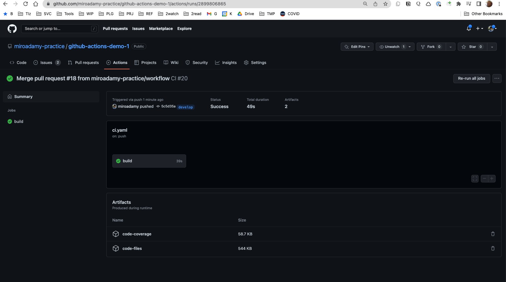

# 05 Creating CI/CD Workflow to automate test and deployment

We need something to deploy as part of the deployment app.

## 05-30 Creating a ReactJS Boilerplate Application

See <https://create-react-app.dev/docs/getting-started>

`npx create-react-app react-app --use-npm`

I will use same repo - in a Gitpod

inside the <https://github.com/miroadamy-practice/github-actions-demo-1>

```sh
gitpod /workspace/github-actions-demo-1 (main) $ npx create-react-app react-app --use-npm
Need to install the following packages:
  create-react-app
Ok to proceed? (y) y
npm WARN deprecated tar@2.2.2: This version of tar is no longer supported, and will not receive security updates. Please upgrade asap.

Creating a new React app in /workspace/github-actions-demo-1/react-app.

Installing packages. This might take a couple of minutes.
Installing react, react-dom, and react-scripts with cra-template...


added 1391 packages in 1m

207 packages are looking for funding
  run `npm fund` for details

Installing template dependencies using npm...

added 55 packages in 4s

207 packages are looking for funding
  run `npm fund` for details
Removing template package using npm...


removed 1 package, and audited 1446 packages in 2s

207 packages are looking for funding
  run `npm fund` for details

6 high severity vulnerabilities

To address all issues (including breaking changes), run:
  npm audit fix --force

Run `npm audit` for details.

Success! Created react-app at /workspace/github-actions-demo-1/react-app
Inside that directory, you can run several commands:

  npm start
    Starts the development server.

  npm run build
    Bundles the app into static files for production.

  npm test
    Starts the test runner.

  npm run eject
    Removes this tool and copies build dependencies, configuration files
    and scripts into the app directory. If you do this, you can’t go back!

We suggest that you begin by typing:

  cd react-app
  npm start

Happy hacking!
npm notice 
npm notice New minor version of npm available! 8.11.0 -> 8.18.0
npm notice Changelog: https://github.com/npm/cli/releases/tag/v8.18.0
npm notice Run npm install -g npm@8.18.0 to update!
npm notice 

```

aa

## 05-31 Building & Testing the Application Locally

See package.json => defines scripts

```json
...
"scripts": {
    "start": "react-scripts start",
    "build": "react-scripts build",
    "test": "react-scripts test",
    "eject": "react-scripts eject"
  },
  ...
```

See also the [README.md](https://github.com/miroadamy-practice/github-actions-demo-1/blob/main/react-app/README.md)

We care only about tests

`npm run test`

```sh
 PASS  src/App.test.js
  ✓ renders learn react link (22 ms)

Test Suites: 1 passed, 1 total
Tests:       1 passed, 1 total
Snapshots:   0 total
Time:        0.331 s, estimated 1 s
Ran all test suites.

Watch Usage
 › Press f to run only failed tests.
 › Press o to only run tests related to changed files.
 › Press q to quit watch mode.
 › Press p to filter by a filename regex pattern.
 › Press t to filter by a test name regex pattern.
 › Press Enter to trigger a test run.
```

Disable watch mode: `CI=true`

```sh
gitpod /workspace/github-actions-demo-1/react-app (main) $ CI=true npm run test

> react-app@0.1.0 test
> react-scripts test

PASS src/App.test.js
  ✓ renders learn react link (44 ms)

Test Suites: 1 passed, 1 total
Tests:       1 passed, 1 total
Snapshots:   0 total
Time:        1.117 s
Ran all test suites.
```

Test checks if we have text `Learn React`

Generate coverage report:

```sh
gitpod /workspace/github-actions-demo-1/react-app (main) $ CI=true npm run test -- --coverage

> react-app@0.1.0 test
> react-scripts test "--coverage"

PASS src/App.test.js
  ✓ renders learn react link (33 ms)

--------------------|---------|----------|---------|---------|-------------------
File                | % Stmts | % Branch | % Funcs | % Lines | Uncovered Line #s 
--------------------|---------|----------|---------|---------|-------------------
All files           |    8.33 |        0 |   33.33 |    8.33 |                   
 App.js             |     100 |      100 |     100 |     100 |                   
 index.js           |       0 |      100 |     100 |       0 | 7-17              
 reportWebVitals.js |       0 |        0 |       0 |       0 | 1-8               
--------------------|---------|----------|---------|---------|-------------------
Test Suites: 1 passed, 1 total
Tests:       1 passed, 1 total
Snapshots:   0 total
Time:        2.259 s
Ran all test suites.

```

It also generates file in lcov-report:

Preview on GitPod:

```sh
gitpod /workspace/github-actions-demo-1/react-app (main) $ pwd
/workspace/github-actions-demo-1/react-app
gitpod /workspace/github-actions-demo-1/react-app (main) $ cd coverage/lcov-report/
gitpod /workspace/github-actions-demo-1/react-app/coverage/lcov-report (main) $ python -m http.server 8000 
Serving HTTP on 0.0.0.0 port 8000 (http://0.0.0.0:8000/) ...
```


Build for production => `npm run build` => `./build`

This is what needs to be deployed for production

## 05-32 Deploying app using Surge

Surge - to deploy static websites: <https://surge.sh/>

```sh
$ npm install --global surge
$ surge
  project: ~/Jane/Desktop/my-project/
   domain: my-project.surge.sh
   upload: [============]
Success! Published and running at my-project.surge.sh
```

Does not work:

```sh
gitpod /workspace/github-actions-demo-1/react-app (main) $ surge

   Welcome to surge! (surge.sh)
   Login (or create surge account) by entering email & password.

          email: miro.adamy@gmail.com
       password: 

   Running as miro.adamy@gmail.com (Student)

        project: /workspace/github-actions-demo-1/react-app/
         domain: instinctive-string.surge.sh
         upload: [====================] 100% eta: 0.0s (17 files, 1266103 bytes)
            CDN: [====================] 100%
     encryption: *.surge.sh, surge.sh (270 days)
             IP: 138.197.235.123

   Success! - Published to instinctive-string.surge.sh
```

Must run after `npm run build` `cd build; surge`

Use `https://instinctive-string.surge.sh/`

Must use same domain every time

## 05-33 Using Prettier to Check for Code Formatting Rules

Enforce fomatting rules - <https://prettier.io/>

`npm install --save-dev --save-exact prettier`

Add `.prettierrc` - from Web config

Add `.prettierignore`

Run locally:

```sh
gitpod /workspace/github-actions-demo-1/react-app (main) $ npx prettier --check "**/*.js" 
Checking formatting...
[warn] src/App.js
[warn] src/App.test.js
[warn] src/index.js
[warn] src/reportWebVitals.js
[warn] Code style issues found in 4 files. Forgot to run Prettier?
```

=> returns != 0 exit code

Format it:

```sh
gitpod /workspace/github-actions-demo-1/react-app (main) $ npx prettier --write "**/*.js" 
src/App.js 63ms
src/App.test.js 9ms
src/index.js 10ms
src/reportWebVitals.js 8ms
src/setupTests.js 3ms
---
gitpod /workspace/github-actions-demo-1/react-app (main) $ npx prettier --check "**/*.js" 
Checking formatting...
All matched files use Prettier code style!
```

Add custom script to `package.json`

```json
...
"scripts": {
    "start": "react-scripts start",
    "build": "react-scripts build",
    "test": "react-scripts test",
    "eject": "react-scripts eject",
    "format:check": "prettier --check \"**/*.{js,jsx,yml,yaml,json,css,scss,md}\"",
    "format": "prettier --write \"**/*.{js,jsx,yml,yaml,json,css,scss,md}\""
  },
...
```

and use as `npm run format:check`

```sh
gitpod /workspace/github-actions-demo-1/react-app (main) $ npm run format:check

> react-app@0.1.0 format:check
> prettier --check "**/*.{js,jsx,yml,yaml,json,css,scss,md}"

Checking formatting...
All matched files use Prettier code style!

---
gitpod /workspace/github-actions-demo-1/react-app (main) $ npm run format

> react-app@0.1.0 format
> prettier --write "**/*.{js,jsx,yml,yaml,json,css,scss,md}"

public/manifest.json 52ms
README.md 57ms
src/App.css 43ms
src/App.js 18ms
src/App.test.js 9ms
src/index.css 6ms
src/index.js 7ms
src/reportWebVitals.js 9ms
src/setupTests.js 3ms
```

3 things for workflow:

* test
* format
* build
* deploy

## 05-34 Planning the workflow

Planning is about: Multiple team members - pushing code, which branches, which PRs

* artifacts => logs (can be downloaded)

master + develop => protected branches, no push, only PR => approved

`master` => deploy to production
`develop` => latest integrated develop code

Feature branch => PR => triggers WF that runs tests and formatting => approve => merge to develop

Merge to develop => WF => tests again, deploys to staging

Merge to master => PR from develop, WF => tests, formatting, review and approve => merge, triggers deployment to production

### Workflows

#### Steps Feature PR

* install dependencies
* check code fmt
* run automated tests
* upload code coverage as artifact
* cache dependecies

#### Steps merge to Develop

* install dependencies
* check code fmt
* run automated tests
* upload code coverage as artifact
* build project
* upload build as artifact
* deploy to staging
* cache dependencies

#### Steps Develop PR

* install dependencies
* check code fmt
* run automated tests
* upload code coverage as artifact
* cache dependecies

#### Steps merge to master

* install dependencies
* check code fmt
* run automated tests
* upload code coverage as artifact
* upload build as artifact
* create a release
* deploy to prod
* upload coverage to Codecov
* cache dependencies

Job failure: => create issue
Issue created => slack message
Release created => send slack message

### Creating release

* releases tab
* release has version, change log, assets

We will generate version number and release notes

## 05-35 Setting Up Our Repository

CODEOWNERS file: <https://docs.github.com/en/repositories/managing-your-repositorys-settings-and-features/customizing-your-repository/about-code-owners>

* create a new file called CODEOWNERS in the root, docs/, or .github/ directory of the repository, in the branch where you'd like to add the code owners.
* different types of files / folder can be owned by different owners
* code owners must have write permissions for the repository
* Code owners are automatically requested for review when someone opens a pull request that modifies code that they own.
* CODEOWNERS file uses a pattern that follows most of the same rules used in gitignore files, with some exceptions. The pattern is followed by one or more GitHub usernames or team names using the standard @username or @org/team-name format.

### Example of CODEOWNERS file

```sh
# This is a comment.
# Each line is a file pattern followed by one or more owners.

# These owners will be the default owners for everything in
# the repo. Unless a later match takes precedence,
# @global-owner1 and @global-owner2 will be requested for
# review when someone opens a pull request.
*       @global-owner1 @global-owner2

# Order is important; the last matching pattern takes the most
# precedence. When someone opens a pull request that only
# modifies JS files, only @js-owner and not the global
# owner(s) will be requested for a review.
*.js    @js-owner

# You can also use email addresses if you prefer. They'll be
# used to look up users just like we do for commit author
# emails.
*.go docs@example.com

# Teams can be specified as code owners as well. Teams should
# be identified in the format @org/team-name. Teams must have
# explicit write access to the repository. In this example,
# the octocats team in the octo-org organization owns all .txt files.
*.txt @octo-org/octocats

# In this example, @doctocat owns any files in the build/logs
# directory at the root of the repository and any of its
# subdirectories.
/build/logs/ @doctocat

# The `docs/*` pattern will match files like
# `docs/getting-started.md` but not further nested files like
# `docs/build-app/troubleshooting.md`.
docs/*  docs@example.com

# In this example, @octocat owns any file in an apps directory
# anywhere in your repository.
apps/ @octocat

# In this example, @doctocat owns any file in the `/docs`
# directory in the root of your repository and any of its
# subdirectories.
/docs/ @doctocat

# In this example, any change inside the `/scripts` directory
# will require approval from @doctocat or @octocat.
/scripts/ @doctocat @octocat

# In this example, @octocat owns any file in the `/apps`
# directory in the root of your repository except for the `/apps/github`
# subdirectory, as its owners are left empty.
/apps/ @octocat
/apps/github
```

I will clear all workflows and set up develop branch

### Branch protection rules

Go to <https://github.com/miroadamy-practice/github-actions-demo-1/settings/branches>

I cannot do this - only one user, cannot approve own PR

Added CODEOWNERS file, removed restrictions - can push and merge locally

## 05-36 Creating the Develop PR workflow

In workflow branch

=> set up that `build` is required for branch merging

I had to remove requirement on PR => cannot approve own PR.
Ali uses second identity, too much hassle

The `ci.yaml` so far:

```yaml
name: CI 
on:
  pull_request:
    branches:
      - develop

jobs:
  build:
    runs-on: ubuntu-latest
    steps:
      - uses: actions/checkout@v3
      - name: use Node 16
        uses: actions/setup-node@v3
        with: 
            node-version: "16"
      - name: Install dependencies
        run: |
          cd react-app
          npm ci 
      - name: Check format
        run: |
          cd react-app
          npm run format:check
      - name: Test
        run: |
          cd react-app
          npm test -- --coverage
        env:
          CI: true
        
          
```

Started to use local VS-Code to save gitpod minutes

## 05-37 Creating the Develop Merge workflow

Running when the feature branch is merged to develop

We can duplicate and modify => duplicate code, or use if conditions

Same branch, using IF statements

For surge, need to use the old domain. Use `surge list` to see the domains

```sh
➜  github-actions-demo-1 git:(workflow) ✗ npx surge list
env: node: No such file or directory
➜  github-actions-demo-1 git:(workflow) ✗ nvm use default
🚨 NVM not loaded! Loading now...
Now using node v16.13.1 (npm v8.3.1)
➜  github-actions-demo-1 git:(workflow) ✗ npx surge list 
Need to install the following packages:
  surge

...

➜  react-app git:(workflow) ✗ npx surge list

   Welcome to surge! (surge.sh)
   Login (or create surge account) by entering email & password.

          email: miro.adamy@gmail.com
       password: 

   1661011326958 instinctive-string.surge.sh   18 hours ago   surge   surge.sh   Standard 

```

Added CNAME file for surge

Consider: [Adding custom domain](https://surge.sh/help/adding-a-custom-domain)

We also need to generate surge token `npx surge token`

```sh
✗ npx surge whoami

   miro.adamy@gmail.com - Student
```

After pushing the workflow branch, the pull_request action runs (because we have the condition to update) - the `build project` and `deploy to staging` did NOT
run: <https://github.com/miroadamy-practice/github-actions-demo-1/runs/7938187576?check_suite_focus=true>

I had an error in build, pushed new commit on `workflow` after the PR was closed:

* The PR stays closed, no CI runs
* need to open new one => <https://github.com/miroadamy-practice/github-actions-demo-1/pull/15>
* triggers the PR action again => <https://github.com/miroadamy-practice/github-actions-demo-1/actions/runs/2898176741>
* merge again => <https://github.com/miroadamy-practice/github-actions-demo-1/actions/runs/2898183804>
* now it worked - <https://github.com/miroadamy-practice/github-actions-demo-1/runs/7938278832?check_suite_focus=true>

test - new branch - `testing-deploy-staging`, change test, push, merge PR

* second attempt (formatting) => <https://github.com/miroadamy-practice/github-actions-demo-1/actions/runs/2898317879>
* merged => <https://github.com/miroadamy-practice/github-actions-demo-1/actions/runs/2898322726>

Goto <https://instinctive-string.surge.sh/>


The Pipeline so far:

```yaml

name: CI 
on:
  pull_request:
    branches: [develop]
  push:
    branches: [develop]

jobs:
  build:
    runs-on: ubuntu-latest
    steps:
      - uses: actions/checkout@v3
      - name: use Node 16
        uses: actions/setup-node@v3
        with: 
            node-version: "16"
      - name: Install dependencies
        run: |
          cd react-app
          npm ci 
      - name: Check format
        run: |
          cd react-app
          npm run format:check
      - name: Test
        run: |
          cd react-app
          npm test -- --coverage
        env:
          CI: true
      - name: Build project
        if: github.event_name == 'push'
        run: |
          cd react-app 
          npm run build
      - name: Deploy to Staging
        if: github.event_name == 'push'
        run: npx surge --project ./react-app/build --domain instinctive-string.surge.sh
        env:
          SURGE_LOGIN: ${{ secrets.SURGE_LOGIN }}
          SURGE_TOKEN: ${{ secrets.SURGE_TOKEN }}


```

## 05-38 Caching NPM Dependencies

See [docs](https://docs.github.com/en/actions/using-workflows/caching-dependencies-to-speed-up-workflows)

Use `actions/cache` => <https://github.com/actions/cache/blob/main/examples.md#node---npm>

Using key: if dependencies has changed. This is why we use `${{ runner.os }}-node-${{ hashFiles('**/package-lock.json') }}`

The restore-key: way how to locate older cache (partial)

First run: <https://github.com/miroadamy-practice/github-actions-demo-1/runs/7938937950?check_suite_focus=true>

```sh
Run actions/cache@v3
Cache not found for input keys: Linux-node-4db6cb19e3209c55595fa8d57848b0d562f090ffba954889c82d1fece29e8e81, Linux-node-

....

Post-cache action - added by GHA

Post job cleanup.
/usr/bin/tar --posix --use-compress-program zstdmt -cf cache.tzst --exclude cache.tzst -P -C /home/runner/work/github-actions-demo-1/github-actions-demo-1 --files-from manifest.txt
Cache Size: ~42 MB (44206882 B)
Cache saved successfully
Cache saved with key: Linux-node-4db6cb19e3209c55595fa8d57848b0d562f090ffba954889c82d1fece29e8e81
```

In the ^^^ - `npm ci` took 26 sec

Let's merge and push:

Did NOT find the cache => different branch !!

```sh
Run actions/cache@v3
Cache not found for input keys: Linux-node-4db6cb19e3209c55595fa8d57848b0d562f090ffba954889c82d1fece29e8e81, Linux-node-
```

Push agains develop: <https://github.com/miroadamy-practice/github-actions-demo-1/runs/7938988403?check_suite_focus=true>

```sh
Run actions/cache@v3
Received 37748736 of 50097829 (75.4%), 35.9 MBs/sec
Received 50097829 of 50097829 (100.0%), 42.5 MBs/sec
Cache Size: ~48 MB (50097829 B)
/usr/bin/tar --use-compress-program unzstd -xf /home/runner/work/_temp/ce4a29e2-864c-405b-897a-5a596fb2fead/cache.tzst -P -C /home/runner/work/github-actions-demo-1/github-actions-demo-1
Cache restored successfully

Cache restored from key: Linux-node-4db6cb19e3209c55595fa8d57848b0d562f090ffba954889c82d1fece29e8e81
```

In the ^^^ - `npm ci` took 13 sec (50%)

## 05-40 Uploading Artifacts in Our Workflows

Artifacts: files generated in the workflow

Using GH action - <https://github.com/actions/upload-artifact>

Upload code coverage => <https://github.com/miroadamy-practice/github-actions-demo-1/actions/runs/2899784789>

```sh
Run actions/upload-artifact@v3
With the provided path, there will be 14 files uploaded
Starting artifact upload
For more detailed logs during the artifact upload process, enable step-debugging: https://docs.github.com/actions/monitoring-and-troubleshooting-workflows/enabling-debug-logging#enabling-step-debug-logging
Artifact name is valid!
Container for artifact "code-coverage" successfully created. Starting upload of file(s)
Total size of all the files uploaded is 19201 bytes
File upload process has finished. Finalizing the artifact upload
Artifact has been finalized. All files have been successfully uploaded!

The raw size of all the files that were specified for upload is 60087 bytes
The size of all the files that were uploaded is 19201 bytes. This takes into account any gzip compression used to reduce the upload size, time and storage

Note: The size of downloaded zips can differ significantly from the reported size. For more information see: https://github.com/actions/upload-artifact#zipped-artifact-downloads 

Artifact code-coverage has been successfully uploaded!
```

We have now artifact in the action - <https://github.com/miroadamy-practice/github-actions-demo-1/actions/runs/2899784789>


Upload build => after build => <https://github.com/miroadamy-practice/github-actions-demo-1/actions/runs/2899806865>



FYI - We also have `actions/download-artifact`

## 05-41  Semantic Versioning & Conventional Commits

When merging to master, we need 3 additional things:

* create release
* upload to production
* upload the coverage to code-coverage

=> need automatically generate version number

### Semantic versioning

=> A.B.C == MAJOR.MINOR.PATCH

* Major - increment breaking changes in API
* Minor - new features - not breaking
* Patch - fixes, not breaking

See <https://semver.org/>

Which update => `conventional commits` => which was the change

See <https://www.conventionalcommits.org/en/v1.0.0/>

```txt
<type>[optional scope]: <description>

[optional body]

[optional footer(s)]
```

* fix:
* feat:
* BREAKING CHANGE:
* recommended others == build:, chore:, ci:, docs:, style:, refactor:, perf:, test:

See <https://github.com/conventional-changelog/commitlint/tree/master/%40commitlint/config-conventional>

### Examples of messages

```txt
feat!: send an email to the customer when a product is shipped
---
chore!: drop support for Node 6

BREAKING CHANGE: use JavaScript features not available in Node 6.
---
feat(lang): add Polish language
---
fix: prevent racing of requests

Introduce a request id and a reference to latest request. Dismiss
incoming responses other than from latest request.

Remove timeouts which were used to mitigate the racing issue but are
obsolete now.

Reviewed-by: Z
Refs: #123

```

### Example how it works

* existing version 2.1.3
* 2 commits
* commit1 => `feat(auth): added Facebook authentication`
* commit2 => `fix(auth): fixed authentication
* => 2.2.0

## 05-42 Installing Semantic Versioning

See <https://github.com/semantic-release/semantic-release>

`npm install --save-dev semantic-release`
=> `npx semantic-release`

After installing it (in workflow branch):

```sh
➜  react-app git:(workflow) ✗ npx semantic-release
[21:12:00] [semantic-release] › ℹ  Running semantic-release version 19.0.4
(node:83442) Warning: "version" is a reserved word.
Please do one of the following:
- Disable version with `yargs.version(false)` if using "version" as an option
- Use the built-in `yargs.version` method instead (if applicable)
- Use a different option key
https://yargs.js.org/docs/#api-reference-version
(Use `node --trace-warnings ...` to show where the warning was created)
[21:12:00] [semantic-release] › ✔  Loaded plugin "verifyConditions" from "@semantic-release/npm"
[21:12:00] [semantic-release] › ✔  Loaded plugin "verifyConditions" from "@semantic-release/github"
[21:12:00] [semantic-release] › ✔  Loaded plugin "analyzeCommits" from "@semantic-release/commit-analyzer"
[21:12:00] [semantic-release] › ✔  Loaded plugin "generateNotes" from "@semantic-release/release-notes-generator"
[21:12:00] [semantic-release] › ✔  Loaded plugin "prepare" from "@semantic-release/npm"
[21:12:00] [semantic-release] › ✔  Loaded plugin "publish" from "@semantic-release/npm"
[21:12:00] [semantic-release] › ✔  Loaded plugin "publish" from "@semantic-release/github"
[21:12:00] [semantic-release] › ✔  Loaded plugin "addChannel" from "@semantic-release/npm"
[21:12:00] [semantic-release] › ✔  Loaded plugin "addChannel" from "@semantic-release/github"
[21:12:00] [semantic-release] › ✔  Loaded plugin "success" from "@semantic-release/github"
[21:12:00] [semantic-release] › ✔  Loaded plugin "fail" from "@semantic-release/github"
[21:12:00] [semantic-release] › ⚠  This run was not triggered in a known CI environment, running in dry-run mode.
[21:12:11] [semantic-release] › ℹ  This test run was triggered on the branch workflow, while semantic-release is configured to only publish from main, therefore a new version won’t be published.

```

## 05-43 Running Semantic Release in Our project

Added to pipeline

```yaml

      - name: Create a release
        if: github.event_name == 'push' && github.ref == 'refs/heads/main'
        run: |
          cd react-app
          npx semantic-release
          env:
            GITHUB_TOKEN: ${{ secrets.GITHUB_TOKEN }}

{%% endraw %}
```

Push and PR to merge to main

First run failed:

```sh
[7:57:39 PM] [semantic-release] › ℹ  Running semantic-release version 19.0.4
(node:1898) Warning: "version" is a reserved word.
Please do one of the following:
- Disable version with `yargs.version(false)` if using "version" as an option
- Use the built-in `yargs.version` method instead (if applicable)
- Use a different option key
https://yargs.js.org/docs/#api-reference-version
(Use `node --trace-warnings ...` to show where the warning was created)
[7:57:39 PM] [semantic-release] › ✔  Loaded plugin "verifyConditions" from "@semantic-release/npm"
[7:57:39 PM] [semantic-release] › ✔  Loaded plugin "verifyConditions" from "@semantic-release/github"
[7:57:39 PM] [semantic-release] › ✔  Loaded plugin "analyzeCommits" from "@semantic-release/commit-analyzer"
[7:57:39 PM] [semantic-release] › ✔  Loaded plugin "generateNotes" from "@semantic-release/release-notes-generator"
[7:57:39 PM] [semantic-release] › ✔  Loaded plugin "prepare" from "@semantic-release/npm"
[7:57:39 PM] [semantic-release] › ✔  Loaded plugin "publish" from "@semantic-release/npm"
[7:57:39 PM] [semantic-release] › ✔  Loaded plugin "publish" from "@semantic-release/github"
[7:57:39 PM] [semantic-release] › ✔  Loaded plugin "addChannel" from "@semantic-release/npm"
[7:57:39 PM] [semantic-release] › ✔  Loaded plugin "addChannel" from "@semantic-release/github"
[7:57:39 PM] [semantic-release] › ✔  Loaded plugin "success" from "@semantic-release/github"
[7:57:39 PM] [semantic-release] › ✔  Loaded plugin "fail" from "@semantic-release/github"
[7:57:41 PM] [semantic-release] › ✔  Run automated release from branch main on repository https://github.com/miroadamy-practice/github-actions-demo-1
[7:57:41 PM] [semantic-release] › ✔  Allowed to push to the Git repository
[7:57:41 PM] [semantic-release] › ℹ  Start step "verifyConditions" of plugin "@semantic-release/npm"
[7:57:41 PM] [semantic-release] › ✔  Completed step "verifyConditions" of plugin "@semantic-release/npm"
[7:57:41 PM] [semantic-release] › ℹ  Start step "verifyConditions" of plugin "@semantic-release/github"
[7:57:41 PM] [semantic-release] [@semantic-release/github] › ℹ  Verify GitHub authentication (https://api.github.com)
[7:57:41 PM] [semantic-release] › ✖  Failed step "verifyConditions" of plugin "@semantic-release/github"
[7:57:41 PM] [semantic-release] › ℹ  Start step "fail" of plugin "@semantic-release/github"
[7:57:41 PM] [semantic-release] [@semantic-release/github] › ℹ  Verify GitHub authentication (https://api.github.com)
[7:57:41 PM] [semantic-release] › ✖  Failed step "fail" of plugin "@semantic-release/github"
[7:57:41 PM] [semantic-release] › ✖  ENOGHTOKEN No GitHub token specified.
A GitHub personal token (https://github.com/semantic-release/github/blob/master/README.md#github-authentication) must be created and set in the GH_TOKEN or GITHUB_TOKEN environment variable on your CI environment.

Please make sure to create a GitHub personal token (https://help.github.com/articles/creating-a-personal-access-token-for-the-command-line) and to set it in the GH_TOKEN or GITHUB_TOKEN environment variable on your CI environment. The token must allow to push to the repository miroadamy-practice/github-actions-demo-1.

[7:57:41 PM] [semantic-release] › ✖  ENOGHTOKEN No GitHub token specified.
A GitHub personal token (https://github.com/semantic-release/github/blob/master/README.md#github-authentication) must be created and set in the GH_TOKEN or GITHUB_TOKEN environment variable on your CI environment.

Please make sure to create a GitHub personal token (https://help.github.com/articles/creating-a-personal-access-token-for-the-command-line) and to set it in the GH_TOKEN or GITHUB_TOKEN environment variable on your CI environment. The token must allow to push to the repository miroadamy-practice/github-actions-demo-1.

AggregateError: 
    SemanticReleaseError: No GitHub token specified.
        at module.exports (/home/runner/work/github-actions-demo-1/github-actions-demo-1/react-app/node_modules/@semantic-release/github/lib/get-error.js:6:10)
        at module.exports (/home/runner/work/github-actions-demo-1/github-actions-demo-1/react-app/node_modules/@semantic-release/github/lib/verify.js:97:17)
        at verifyConditions (/home/runner/work/github-actions-demo-1/github-actions-demo-1/react-app/node_modules/@semantic-release/github/index.js:27:9)
        at validator (/home/runner/work/github-actions-demo-1/github-actions-demo-1/react-app/node_modules/semantic-release/lib/plugins/normalize.js:34:30)
        at /home/runner/work/github-actions-demo-1/github-actions-demo-1/react-app/node_modules/semantic-release/lib/plugins/pipeline.js:37:40
        at next (/home/runner/work/github-actions-demo-1/github-actions-demo-1/react-app/node_modules/p-reduce/index.js:17:9)
    at /home/runner/work/github-actions-demo-1/github-actions-demo-1/react-app/node_modules/semantic-release/lib/plugins/pipeline.js:54:11
    at async Object.pluginsConf.<computed> [as verifyConditions] (/home/runner/work/github-actions-demo-1/github-actions-demo-1/react-app/node_modules/semantic-release/lib/plugins/index.js:80:11)
    at async run (/home/runner/work/github-actions-demo-1/github-actions-demo-1/react-app/node_modules/semantic-release/index.js:103:3)
    at async module.exports (/home/runner/work/github-actions-demo-1/github-actions-demo-1/react-app/node_modules/semantic-release/index.js:269:22)
    at async module.exports (/home/runner/work/github-actions-demo-1/github-actions-demo-1/react-app/node_modules/semantic-release/cli.js:55:5)
Error: Process completed with exit code 1.
```

Tried: (note the alignment)

```yaml

      - name: Create a release
        if: github.event_name == 'push' && github.ref == 'refs/heads/main'
        run: |
          cd react-app
          npx semantic-release
        env:
          GITHUB_TOKEN: ${{ secrets.GITHUB_TOKEN }}

{%% endraw %}
```

```sh
Run cd react-app
[8:11:56 PM] [semantic-release] › ℹ  Running semantic-release version 19.0.4
(node:1834) Warning: "version" is a reserved word.
Please do one of the following:
- Disable version with `yargs.version(false)` if using "version" as an option
- Use the built-in `yargs.version` method instead (if applicable)
- Use a different option key
https://yargs.js.org/docs/#api-reference-version
(Use `node --trace-warnings ...` to show where the warning was created)
[8:11:56 PM] [semantic-release] › ✔  Loaded plugin "verifyConditions" from "@semantic-release/npm"
[8:11:56 PM] [semantic-release] › ✔  Loaded plugin "verifyConditions" from "@semantic-release/github"
[8:11:56 PM] [semantic-release] › ✔  Loaded plugin "analyzeCommits" from "@semantic-release/commit-analyzer"
[8:11:56 PM] [semantic-release] › ✔  Loaded plugin "generateNotes" from "@semantic-release/release-notes-generator"
[8:11:56 PM] [semantic-release] › ✔  Loaded plugin "prepare" from "@semantic-release/npm"
[8:11:56 PM] [semantic-release] › ✔  Loaded plugin "publish" from "@semantic-release/npm"
[8:11:56 PM] [semantic-release] › ✔  Loaded plugin "publish" from "@semantic-release/github"
[8:11:56 PM] [semantic-release] › ✔  Loaded plugin "addChannel" from "@semantic-release/npm"
[8:11:56 PM] [semantic-release] › ✔  Loaded plugin "addChannel" from "@semantic-release/github"
[8:11:56 PM] [semantic-release] › ✔  Loaded plugin "success" from "@semantic-release/github"
[8:11:56 PM] [semantic-release] › ✔  Loaded plugin "fail" from "@semantic-release/github"
[8:11:59 PM] [semantic-release] › ✔  Run automated release from branch main on repository https://github.com/miroadamy-practice/github-actions-demo-1
[8:12:01 PM] [semantic-release] › ✔  Allowed to push to the Git repository
[8:12:01 PM] [semantic-release] › ℹ  Start step "verifyConditions" of plugin "@semantic-release/npm"
[8:12:01 PM] [semantic-release] › ✔  Completed step "verifyConditions" of plugin "@semantic-release/npm"
[8:12:01 PM] [semantic-release] › ℹ  Start step "verifyConditions" of plugin "@semantic-release/github"
[8:12:01 PM] [semantic-release] [@semantic-release/github] › ℹ  Verify GitHub authentication (https://api.github.com)
[8:12:01 PM] [semantic-release] › ✔  Completed step "verifyConditions" of plugin "@semantic-release/github"
[8:12:01 PM] [semantic-release] › ℹ  Found git tag v0.1.0 associated with version 0.1.0 on branch main
[8:12:01 PM] [semantic-release] › ℹ  Found 84 commits since last release
[8:12:01 PM] [semantic-release] › ℹ  Start step "analyzeCommits" of plugin "@semantic-release/commit-analyzer"
[8:12:01 PM] [semantic-release] [@semantic-release/commit-analyzer] › ℹ  Analyzing commit: Merge pull request #20 from miroadamy-practice/workflow

Workflow
[8:12:01 PM] [semantic-release] [@semantic-release/commit-analyzer] › ℹ  The commit should not trigger a release
[8:12:01 PM] [semantic-release] [@semantic-release/commit-analyzer] › ℹ  Analyzing commit: Merge branch 'main' into workflow
[8:12:01 PM] [semantic-release] [@semantic-release/commit-analyzer] › ℹ  The commit should not trigger a release
[8:12:01 PM] [semantic-release] [@semantic-release/commit-analyzer] › ℹ  Analyzing commit: fix: Different alignment
[8:12:01 PM] [semantic-release] [@semantic-release/commit-analyzer] › ℹ  The release type for the commit is patch
[8:12:01 PM] [semantic-release] [@semantic-release/commit-analyzer] › ℹ  Analyzing commit: fix: using github.token
[8:12:01 PM] [semantic-release] [@semantic-release/commit-analyzer] › ℹ  The release type for the commit is patch
[8:12:01 PM] [semantic-release] [@semantic-release/commit-analyzer] › ℹ  Analyzing commit: Merge pull request #19 from miroadamy-practice/workflow

Workflow
[8:12:01 PM] [semantic-release] [@semantic-release/commit-analyzer] › ℹ  The commit should not trigger a release
[8:12:01 PM] [semantic-release] [@semantic-release/commit-analyzer] › ℹ  Analyzing commit: fix: corrected formatting
[8:12:01 PM] [semantic-release] [@semantic-release/commit-analyzer] › ℹ  The release type for the commit is patch
[8:12:01 PM] [semantic-release] [@semantic-release/commit-analyzer] › ℹ  Analyzing commit: feat: added semantic-release
[8:12:01 PM] [semantic-release] [@semantic-release/commit-analyzer] › ℹ  The release type for the commit is minor
[8:12:01 PM] [semantic-release] [@semantic-release/commit-analyzer] › ℹ  Analyzing commit: fix: added the semantic versioning config
[8:12:01 PM] [semantic-release] [@semantic-release/commit-analyzer] › ℹ  The release type for the commit is patch
[8:12:01 PM] [semantic-release] [@semantic-release/commit-analyzer] › ℹ  Analyzing commit: Installed semantic versioning
[8:12:01 PM] [semantic-release] [@semantic-release/commit-analyzer] › ℹ  The commit should not trigger a release
[8:12:01 PM] [semantic-release] [@semantic-release/commit-analyzer] › ℹ  Analyzing commit: Merge pull request #18 from miroadamy-practice/workflow

Added artifact upload
[8:12:01 PM] [semantic-release] [@semantic-release/commit-analyzer] › ℹ  The commit should not trigger a release
[8:12:01 PM] [semantic-release] [@semantic-release/commit-analyzer] › ℹ  Analyzing commit: Upload build only after there is a build
[8:12:01 PM] [semantic-release] [@semantic-release/commit-analyzer] › ℹ  The commit should not trigger a release
[8:12:01 PM] [semantic-release] [@semantic-release/commit-analyzer] › ℹ  Analyzing commit: Same typo twice
[8:12:01 PM] [semantic-release] [@semantic-release/commit-analyzer] › ℹ  The commit should not trigger a release
[8:12:01 PM] [semantic-release] [@semantic-release/commit-analyzer] › ℹ  Analyzing commit: Typo in action name
[8:12:01 PM] [semantic-release] [@semantic-release/commit-analyzer] › ℹ  The commit should not trigger a release
[8:12:01 PM] [semantic-release] [@semantic-release/commit-analyzer] › ℹ  Analyzing commit: Added artifact upload
[8:12:01 PM] [semantic-release] [@semantic-release/commit-analyzer] › ℹ  The commit should not trigger a release
[8:12:01 PM] [semantic-release] [@semantic-release/commit-analyzer] › ℹ  Analyzing commit: Push against develop
[8:12:01 PM] [semantic-release] [@semantic-release/commit-analyzer] › ℹ  The commit should not trigger a release
[8:12:01 PM] [semantic-release] [@semantic-release/commit-analyzer] › ℹ  Analyzing commit: Merge pull request #17 from miroadamy-practice/workflow

Adding caching to workflow
[8:12:01 PM] [semantic-release] [@semantic-release/commit-analyzer] › ℹ  The commit should not trigger a release
[8:12:01 PM] [semantic-release] [@semantic-release/commit-analyzer] › ℹ  Analyzing commit: Merge commit 'decf9dbb177123060877a02666643436e6df6147' into workflow
[8:12:01 PM] [semantic-release] [@semantic-release/commit-analyzer] › ℹ  The commit should not trigger a release
[8:12:01 PM] [semantic-release] [@semantic-release/commit-analyzer] › ℹ  Analyzing commit: YAML fix
[8:12:01 PM] [semantic-release] [@semantic-release/commit-analyzer] › ℹ  The commit should not trigger a release
[8:12:01 PM] [semantic-release] [@semantic-release/commit-analyzer] › ℹ  Analyzing commit: Merge branch 'develop' into workflow
[8:12:01 PM] [semantic-release] [@semantic-release/commit-analyzer] › ℹ  The commit should not trigger a release
[8:12:01 PM] [semantic-release] [@semantic-release/commit-analyzer] › ℹ  Analyzing commit: Adding caching to workflow
[8:12:01 PM] [semantic-release] [@semantic-release/commit-analyzer] › ℹ  The commit should not trigger a release
[8:12:01 PM] [semantic-release] [@semantic-release/commit-analyzer] › ℹ  Analyzing commit: Merge pull request #16 from miroadamy-practice/testing-deploy-staging

Demo change
[8:12:01 PM] [semantic-release] [@semantic-release/commit-analyzer] › ℹ  The commit should not trigger a release
[8:12:01 PM] [semantic-release] [@semantic-release/commit-analyzer] › ℹ  Analyzing commit: Reformated
[8:12:01 PM] [semantic-release] [@semantic-release/commit-analyzer] › ℹ  The commit should not trigger a release
[8:12:01 PM] [semantic-release] [@semantic-release/commit-analyzer] › ℹ  Analyzing commit: Demo change
[8:12:01 PM] [semantic-release] [@semantic-release/commit-analyzer] › ℹ  The commit should not trigger a release
[8:12:01 PM] [semantic-release] [@semantic-release/commit-analyzer] › ℹ  Analyzing commit: Merge pull request #15 from miroadamy-practice/workflow

Fixes in workflow
[8:12:01 PM] [semantic-release] [@semantic-release/commit-analyzer] › ℹ  The commit should not trigger a release
[8:12:01 PM] [semantic-release] [@semantic-release/commit-analyzer] › ℹ  Analyzing commit: Fixes in workflow
[8:12:01 PM] [semantic-release] [@semantic-release/commit-analyzer] › ℹ  The commit should not trigger a release
[8:12:01 PM] [semantic-release] [@semantic-release/commit-analyzer] › ℹ  Analyzing commit: Merge pull request #13 from miroadamy-practice/workflow

PR to Develop - testing merge - First
[8:12:01 PM] [semantic-release] [@semantic-release/commit-analyzer] › ℹ  The commit should not trigger a release
[8:12:01 PM] [semantic-release] [@semantic-release/commit-analyzer] › ℹ  Analyzing commit: Adding workflow for merge
[8:12:01 PM] [semantic-release] [@semantic-release/commit-analyzer] › ℹ  The commit should not trigger a release
[8:12:01 PM] [semantic-release] [@semantic-release/commit-analyzer] › ℹ  Analyzing commit: Fix: npm run
[8:12:01 PM] [semantic-release] [@semantic-release/commit-analyzer] › ℹ  The commit should not trigger a release
[8:12:01 PM] [semantic-release] [@semantic-release/commit-analyzer] › ℹ  Analyzing commit: Fix - Node version
[8:12:01 PM] [semantic-release] [@semantic-release/commit-analyzer] › ℹ  The commit should not trigger a release
[8:12:01 PM] [semantic-release] [@semantic-release/commit-analyzer] › ℹ  Analyzing commit: PR to Develop
[8:12:01 PM] [semantic-release] [@semantic-release/commit-analyzer] › ℹ  The commit should not trigger a release
[8:12:01 PM] [semantic-release] [@semantic-release/commit-analyzer] › ℹ  Analyzing commit: Merge remote-tracking branch 'origin/chapter/04-29'
[8:12:01 PM] [semantic-release] [@semantic-release/commit-analyzer] › ℹ  The commit should not trigger a release
[8:12:01 PM] [semantic-release] [@semantic-release/commit-analyzer] › ℹ  Analyzing commit: Added CodeOwners
[8:12:01 PM] [semantic-release] [@semantic-release/commit-analyzer] › ℹ  The commit should not trigger a release
[8:12:01 PM] [semantic-release] [@semantic-release/commit-analyzer] › ℹ  Analyzing commit: Can I push to develop ?
[8:12:01 PM] [semantic-release] [@semantic-release/commit-analyzer] › ℹ  The commit should not trigger a release
[8:12:01 PM] [semantic-release] [@semantic-release/commit-analyzer] › ℹ  Analyzing commit: Removed the previous workflow files
[8:12:01 PM] [semantic-release] [@semantic-release/commit-analyzer] › ℹ  The commit should not trigger a release
[8:12:01 PM] [semantic-release] [@semantic-release/commit-analyzer] › ℹ  Analyzing commit: Add format code
[8:12:01 PM] [semantic-release] [@semantic-release/commit-analyzer] › ℹ  The commit should not trigger a release
[8:12:01 PM] [semantic-release] [@semantic-release/commit-analyzer] › ℹ  Analyzing commit: package.json
[8:12:01 PM] [semantic-release] [@semantic-release/commit-analyzer] › ℹ  The commit should not trigger a release
[8:12:01 PM] [semantic-release] [@semantic-release/commit-analyzer] › ℹ  Analyzing commit: npm script for formatting
[8:12:01 PM] [semantic-release] [@semantic-release/commit-analyzer] › ℹ  The commit should not trigger a release
[8:12:01 PM] [semantic-release] [@semantic-release/commit-analyzer] › ℹ  Analyzing commit: After prettier run with 2 spaces
[8:12:01 PM] [semantic-release] [@semantic-release/commit-analyzer] › ℹ  The commit should not trigger a release
[8:12:01 PM] [semantic-release] [@semantic-release/commit-analyzer] › ℹ  Analyzing commit: Added Prettier
[8:12:01 PM] [semantic-release] [@semantic-release/commit-analyzer] › ℹ  The commit should not trigger a release
[8:12:01 PM] [semantic-release] [@semantic-release/commit-analyzer] › ℹ  Analyzing commit: Fix in gitpod
[8:12:01 PM] [semantic-release] [@semantic-release/commit-analyzer] › ℹ  The commit should not trigger a release
[8:12:01 PM] [semantic-release] [@semantic-release/commit-analyzer] › ℹ  Analyzing commit: Generated react-app
[8:12:01 PM] [semantic-release] [@semantic-release/commit-analyzer] › ℹ  The commit should not trigger a release
[8:12:01 PM] [semantic-release] [@semantic-release/commit-analyzer] › ℹ  Analyzing commit: Updated action text + added secret
[8:12:01 PM] [semantic-release] [@semantic-release/commit-analyzer] › ℹ  The commit should not trigger a release
[8:12:01 PM] [semantic-release] [@semantic-release/commit-analyzer] › ℹ  Analyzing commit: Sending slack message
[8:12:01 PM] [semantic-release] [@semantic-release/commit-analyzer] › ℹ  The commit should not trigger a release
[8:12:01 PM] [semantic-release] [@semantic-release/commit-analyzer] › ℹ  Analyzing commit: Merge pull request #10 from miroadamy-practice:chapter/04-28

Trying script in and out of Docker
[8:12:01 PM] [semantic-release] [@semantic-release/commit-analyzer] › ℹ  The commit should not trigger a release
[8:12:01 PM] [semantic-release] [@semantic-release/commit-analyzer] › ℹ  Analyzing commit: Trying script in and out of Docker
[8:12:01 PM] [semantic-release] [@semantic-release/commit-analyzer] › ℹ  The commit should not trigger a release
[8:12:01 PM] [semantic-release] [@semantic-release/commit-analyzer] › ℹ  Analyzing commit: Merge pull request #9 from miroadamy-practice/chapter/04-27

Steps with containers
[8:12:01 PM] [semantic-release] [@semantic-release/commit-analyzer] › ℹ  The commit should not trigger a release
[8:12:01 PM] [semantic-release] [@semantic-release/commit-analyzer] › ℹ  Analyzing commit: Steps with containers
[8:12:01 PM] [semantic-release] [@semantic-release/commit-analyzer] › ℹ  The commit should not trigger a release
[8:12:01 PM] [semantic-release] [@semantic-release/commit-analyzer] › ℹ  Analyzing commit: Merge pull request #8 from miroadamy-practice/chapter/04-26

test multi-container
[8:12:01 PM] [semantic-release] [@semantic-release/commit-analyzer] › ℹ  The commit should not trigger a release
[8:12:01 PM] [semantic-release] [@semantic-release/commit-analyzer] › ℹ  Analyzing commit: test multi-container
[8:12:01 PM] [semantic-release] [@semantic-release/commit-analyzer] › ℹ  The commit should not trigger a release
[8:12:01 PM] [semantic-release] [@semantic-release/commit-analyzer] › ℹ  Analyzing commit: Merge pull request #7 from miroadamy-practice/chapter/04-24

base container
[8:12:01 PM] [semantic-release] [@semantic-release/commit-analyzer] › ℹ  The commit should not trigger a release
[8:12:01 PM] [semantic-release] [@semantic-release/commit-analyzer] › ℹ  Analyzing commit: Compare with plain job
[8:12:01 PM] [semantic-release] [@semantic-release/commit-analyzer] › ℹ  The commit should not trigger a release
[8:12:01 PM] [semantic-release] [@semantic-release/commit-analyzer] › ℹ  Analyzing commit: Lowercase, of course
[8:12:01 PM] [semantic-release] [@semantic-release/commit-analyzer] › ℹ  The commit should not trigger a release
[8:12:01 PM] [semantic-release] [@semantic-release/commit-analyzer] › ℹ  Analyzing commit: base container
[8:12:01 PM] [semantic-release] [@semantic-release/commit-analyzer] › ℹ  The commit should not trigger a release
[8:12:01 PM] [semantic-release] [@semantic-release/commit-analyzer] › ℹ  Analyzing commit: Merge pull request #6 from miroadamy-practice/chapter/04-20

Setup node - simple
[8:12:01 PM] [semantic-release] [@semantic-release/commit-analyzer] › ℹ  The commit should not trigger a release
[8:12:01 PM] [semantic-release] [@semantic-release/commit-analyzer] › ℹ  Analyzing commit: Include and exclude
[8:12:01 PM] [semantic-release] [@semantic-release/commit-analyzer] › ℹ  The commit should not trigger a release
[8:12:01 PM] [semantic-release] [@semantic-release/commit-analyzer] › ℹ  Analyzing commit: Also log in matrix
[8:12:01 PM] [semantic-release] [@semantic-release/commit-analyzer] › ℹ  The commit should not trigger a release
[8:12:01 PM] [semantic-release] [@semantic-release/commit-analyzer] › ℹ  Analyzing commit: Also run dump context
[8:12:01 PM] [semantic-release] [@semantic-release/commit-analyzer] › ℹ  The commit should not trigger a release
[8:12:01 PM] [semantic-release] [@semantic-release/commit-analyzer] › ℹ  Analyzing commit: Using strategy
[8:12:01 PM] [semantic-release] [@semantic-release/commit-analyzer] › ℹ  The commit should not trigger a release
[8:12:01 PM] [semantic-release] [@semantic-release/commit-analyzer] › ℹ  Analyzing commit: lowercase @v3
[8:12:01 PM] [semantic-release] [@semantic-release/commit-analyzer] › ℹ  The commit should not trigger a release
[8:12:01 PM] [semantic-release] [@semantic-release/commit-analyzer] › ℹ  Analyzing commit: Correct parameters: @v3, version14
[8:12:01 PM] [semantic-release] [@semantic-release/commit-analyzer] › ℹ  The commit should not trigger a release
[8:12:01 PM] [semantic-release] [@semantic-release/commit-analyzer] › ℹ  Analyzing commit: Setup node - simple
[8:12:01 PM] [semantic-release] [@semantic-release/commit-analyzer] › ℹ  The commit should not trigger a release
[8:12:01 PM] [semantic-release] [@semantic-release/commit-analyzer] › ℹ  Analyzing commit: Merge commit 'ee110399f6a67633bc8747d13348e203d11ad91d'
[8:12:01 PM] [semantic-release] [@semantic-release/commit-analyzer] › ℹ  The commit should not trigger a release
[8:12:01 PM] [semantic-release] [@semantic-release/commit-analyzer] › ℹ  Analyzing commit: Demo using functions
[8:12:01 PM] [semantic-release] [@semantic-release/commit-analyzer] › ℹ  The commit should not trigger a release
[8:12:01 PM] [semantic-release] [@semantic-release/commit-analyzer] › ℹ  Analyzing commit: Merge pull request #5 from miroadamy-practice/chapter/03-17

Log contexts
[8:12:01 PM] [semantic-release] [@semantic-release/commit-analyzer] › ℹ  The commit should not trigger a release
[8:12:01 PM] [semantic-release] [@semantic-release/commit-analyzer] › ℹ  Analyzing commit: Log contexts
[8:12:01 PM] [semantic-release] [@semantic-release/commit-analyzer] › ℹ  The commit should not trigger a release
[8:12:01 PM] [semantic-release] [@semantic-release/commit-analyzer] › ℹ  Analyzing commit: Random file
[8:12:01 PM] [semantic-release] [@semantic-release/commit-analyzer] › ℹ  The commit should not trigger a release
[8:12:01 PM] [semantic-release] [@semantic-release/commit-analyzer] › ℹ  Analyzing commit: No master, main
[8:12:01 PM] [semantic-release] [@semantic-release/commit-analyzer] › ℹ  The commit should not trigger a release
[8:12:01 PM] [semantic-release] [@semantic-release/commit-analyzer] › ℹ  Analyzing commit: Update repo
[8:12:01 PM] [semantic-release] [@semantic-release/commit-analyzer] › ℹ  The commit should not trigger a release
[8:12:01 PM] [semantic-release] [@semantic-release/commit-analyzer] › ℹ  Analyzing commit: Limit the trigger
[8:12:01 PM] [semantic-release] [@semantic-release/commit-analyzer] › ℹ  The commit should not trigger a release
[8:12:01 PM] [semantic-release] [@semantic-release/commit-analyzer] › ℹ  Analyzing commit: Merge commit '59a629dd898945511f096be870ebe9b3e8988ad6'
[8:12:01 PM] [semantic-release] [@semantic-release/commit-analyzer] › ℹ  The commit should not trigger a release
[8:12:01 PM] [semantic-release] [@semantic-release/commit-analyzer] › ℹ  Analyzing commit: Create issue programatically
[8:12:01 PM] [semantic-release] [@semantic-release/commit-analyzer] › ℹ  The commit should not trigger a release
[8:12:01 PM] [semantic-release] [@semantic-release/commit-analyzer] › ℹ  Analyzing commit: Merge pull request #3 from miroadamy-practice/chapter/03-13

env-vars 03-13
[8:12:01 PM] [semantic-release] [@semantic-release/commit-analyzer] › ℹ  The commit should not trigger a release
[8:12:01 PM] [semantic-release] [@semantic-release/commit-analyzer] › ℹ  Analyzing commit: env-vars 03-13
[8:12:01 PM] [semantic-release] [@semantic-release/commit-analyzer] › ℹ  The commit should not trigger a release
[8:12:01 PM] [semantic-release] [@semantic-release/commit-analyzer] › ℹ  Analyzing commit: Fix - must be string
[8:12:01 PM] [semantic-release] [@semantic-release/commit-analyzer] › ℹ  The commit should not trigger a release
[8:12:01 PM] [semantic-release] [@semantic-release/commit-analyzer] › ℹ  Analyzing commit: Showing payload
[8:12:01 PM] [semantic-release] [@semantic-release/commit-analyzer] › ℹ  The commit should not trigger a release
[8:12:01 PM] [semantic-release] [@semantic-release/commit-analyzer] › ℹ  Analyzing commit: Using dispatch
[8:12:01 PM] [semantic-release] [@semantic-release/commit-analyzer] › ℹ  The commit should not trigger a release
[8:12:01 PM] [semantic-release] [@semantic-release/commit-analyzer] › ℹ  Analyzing commit: Schedules off
[8:12:01 PM] [semantic-release] [@semantic-release/commit-analyzer] › ℹ  The commit should not trigger a release
[8:12:01 PM] [semantic-release] [@semantic-release/commit-analyzer] › ℹ  Analyzing commit: CHANGED to */15 and 0/20 to see over longer time
[8:12:01 PM] [semantic-release] [@semantic-release/commit-analyzer] › ℹ  The commit should not trigger a release
[8:12:01 PM] [semantic-release] [@semantic-release/commit-analyzer] › ℹ  Analyzing commit: Another change - schedule only, 2 cron expressions, */5 and 0/3
[8:12:01 PM] [semantic-release] [@semantic-release/commit-analyzer] › ℹ  The commit should not trigger a release
[8:12:01 PM] [semantic-release] [@semantic-release/commit-analyzer] › ℹ  Analyzing commit: Changed quoting
[8:12:01 PM] [semantic-release] [@semantic-release/commit-analyzer] › ℹ  The commit should not trigger a release
[8:12:01 PM] [semantic-release] [@semantic-release/commit-analyzer] › ℹ  Analyzing commit: The 0/5 never triggered, back to */5
[8:12:01 PM] [semantic-release] [@semantic-release/commit-analyzer] › ℹ  The commit should not trigger a release
[8:12:01 PM] [semantic-release] [@semantic-release/commit-analyzer] › ℹ  Analyzing commit: Changed to 0/5 from */5
[8:12:01 PM] [semantic-release] [@semantic-release/commit-analyzer] › ℹ  The commit should not trigger a release
[8:12:01 PM] [semantic-release] [@semantic-release/commit-analyzer] › ℹ  Analyzing commit: Fix the expression
[8:12:01 PM] [semantic-release] [@semantic-release/commit-analyzer] › ℹ  The commit should not trigger a release
[8:12:01 PM] [semantic-release] [@semantic-release/commit-analyzer] › ℹ  Analyzing commit: testing cron
[8:12:01 PM] [semantic-release] [@semantic-release/commit-analyzer] › ℹ  The commit should not trigger a release
[8:12:01 PM] [semantic-release] [@semantic-release/commit-analyzer] › ℹ  Analysis of 84 commits complete: minor release
[8:12:01 PM] [semantic-release] › ✔  Completed step "analyzeCommits" of plugin "@semantic-release/commit-analyzer"
[8:12:01 PM] [semantic-release] › ℹ  The next release version is 0.2.0
[8:12:01 PM] [semantic-release] › ℹ  Start step "generateNotes" of plugin "@semantic-release/release-notes-generator"
[8:12:01 PM] [semantic-release] › ✔  Completed step "generateNotes" of plugin "@semantic-release/release-notes-generator"
[8:12:01 PM] [semantic-release] › ℹ  Start step "prepare" of plugin "@semantic-release/npm"
[8:12:01 PM] [semantic-release] [@semantic-release/npm] › ℹ  Write version 0.2.0 to package.json in /home/runner/work/github-actions-demo-1/github-actions-demo-1/react-app
v0.2.0
[8:12:02 PM] [semantic-release] › ✔  Completed step "prepare" of plugin "@semantic-release/npm"
[8:12:04 PM] [semantic-release] › ✔  Created tag v0.2.0
[8:12:04 PM] [semantic-release] › ℹ  Start step "publish" of plugin "@semantic-release/npm"
[8:12:04 PM] [semantic-release] [@semantic-release/npm] › ℹ  Skip publishing to npm registry as package.json's private property is true
[8:12:04 PM] [semantic-release] › ✔  Completed step "publish" of plugin "@semantic-release/npm"
[8:12:04 PM] [semantic-release] › ℹ  Start step "publish" of plugin "@semantic-release/github"
[8:12:05 PM] [semantic-release] [@semantic-release/github] › ℹ  Published GitHub release: https://github.com/miroadamy-practice/github-actions-demo-1/releases/tag/v0.2.0
[8:12:05 PM] [semantic-release] › ✔  Completed step "publish" of plugin "@semantic-release/github"
[8:12:05 PM] [semantic-release] › ℹ  Start step "success" of plugin "@semantic-release/github"
[8:13:07 PM] [semantic-release] [@semantic-release/github] › ℹ  Added comment to issue #20: https://github.com/miroadamy-practice/github-actions-demo-1/pull/20#issuecomment-1222914960
[8:13:10 PM] [semantic-release] [@semantic-release/github] › ℹ  Added comment to issue #19: https://github.com/miroadamy-practice/github-actions-demo-1/pull/19#issuecomment-1222915077
[8:13:13 PM] [semantic-release] [@semantic-release/github] › ℹ  Added comment to issue #18: https://github.com/miroadamy-practice/github-actions-demo-1/pull/18#issuecomment-1222915219
[8:13:16 PM] [semantic-release] [@semantic-release/github] › ℹ  Added comment to issue #17: https://github.com/miroadamy-practice/github-actions-demo-1/pull/17#issuecomment-1222915351
[8:13:19 PM] [semantic-release] [@semantic-release/github] › ℹ  Added comment to issue #16: https://github.com/miroadamy-practice/github-actions-demo-1/pull/16#issuecomment-1222915476
[8:13:22 PM] [semantic-release] [@semantic-release/github] › ℹ  Added comment to issue #15: https://github.com/miroadamy-practice/github-actions-demo-1/pull/15#issuecomment-1222915583
[8:13:25 PM] [semantic-release] [@semantic-release/github] › ℹ  Added comment to issue #13: https://github.com/miroadamy-practice/github-actions-demo-1/pull/13#issuecomment-1222915708
[8:13:28 PM] [semantic-release] [@semantic-release/github] › ℹ  Added comment to issue #12: https://github.com/miroadamy-practice/github-actions-demo-1/pull/12#issuecomment-1222915832
[8:13:31 PM] [semantic-release] [@semantic-release/github] › ℹ  Added comment to issue #11: https://github.com/miroadamy-practice/github-actions-demo-1/pull/11#issuecomment-1222915942
[8:13:34 PM] [semantic-release] [@semantic-release/github] › ℹ  Added comment to issue #10: https://github.com/miroadamy-practice/github-actions-demo-1/pull/10#issuecomment-1222916065
[8:13:37 PM] [semantic-release] [@semantic-release/github] › ℹ  Added comment to issue #9: https://github.com/miroadamy-practice/github-actions-demo-1/pull/9#issuecomment-1222916161
[8:13:40 PM] [semantic-release] [@semantic-release/github] › ℹ  Added comment to issue #8: https://github.com/miroadamy-practice/github-actions-demo-1/pull/8#issuecomment-1222916267
[8:13:43 PM] [semantic-release] [@semantic-release/github] › ℹ  Added comment to issue #7: https://github.com/miroadamy-practice/github-actions-demo-1/pull/7#issuecomment-1222916438
[8:13:46 PM] [semantic-release] [@semantic-release/github] › ℹ  Added comment to issue #6: https://github.com/miroadamy-practice/github-actions-demo-1/pull/6#issuecomment-1222916563
[8:13:49 PM] [semantic-release] [@semantic-release/github] › ℹ  Added comment to issue #5: https://github.com/miroadamy-practice/github-actions-demo-1/pull/5#issuecomment-1222916712
[8:13:52 PM] [semantic-release] [@semantic-release/github] › ℹ  Added comment to issue #3: https://github.com/miroadamy-practice/github-actions-demo-1/pull/3#issuecomment-1222916838
[8:13:55 PM] [semantic-release] [@semantic-release/github] › ℹ  Added labels [ 'released' ] to issue #20
[8:13:59 PM] [semantic-release] [@semantic-release/github] › ℹ  Added labels [ 'released' ] to issue #19
[8:14:01 PM] [semantic-release] [@semantic-release/github] › ℹ  Added labels [ 'released' ] to issue #18
[8:14:04 PM] [semantic-release] [@semantic-release/github] › ℹ  Added labels [ 'released' ] to issue #17
[8:14:08 PM] [semantic-release] [@semantic-release/github] › ℹ  Added labels [ 'released' ] to issue #16
[8:14:10 PM] [semantic-release] [@semantic-release/github] › ℹ  Added labels [ 'released' ] to issue #15
[8:14:13 PM] [semantic-release] [@semantic-release/github] › ℹ  Added labels [ 'released' ] to issue #13
[8:14:16 PM] [semantic-release] [@semantic-release/github] › ℹ  Added labels [ 'released' ] to issue #12
[8:14:19 PM] [semantic-release] [@semantic-release/github] › ℹ  Added labels [ 'released' ] to issue #11
[8:14:22 PM] [semantic-release] [@semantic-release/github] › ℹ  Added labels [ 'released' ] to issue #10
[8:14:25 PM] [semantic-release] [@semantic-release/github] › ℹ  Added labels [ 'released' ] to issue #9
[8:14:28 PM] [semantic-release] [@semantic-release/github] › ℹ  Added labels [ 'released' ] to issue #8
[8:14:31 PM] [semantic-release] [@semantic-release/github] › ℹ  Added labels [ 'released' ] to issue #7
[8:14:34 PM] [semantic-release] [@semantic-release/github] › ℹ  Added labels [ 'released' ] to issue #6
[8:14:37 PM] [semantic-release] [@semantic-release/github] › ℹ  Added labels [ 'released' ] to issue #5
[8:14:40 PM] [semantic-release] [@semantic-release/github] › ℹ  Added labels [ 'released' ] to issue #3
[8:14:40 PM] [semantic-release] › ✖  Failed step "success" of plugin "@semantic-release/github"
[8:14:40 PM] [semantic-release] › ✖  An error occurred while running semantic-release: RequestError [HttpError]: You have exceeded a secondary rate limit. Please wait a few minutes before you try again.
    at /home/runner/work/github-actions-demo-1/github-actions-demo-1/react-app/node_modules/@octokit/request/dist-node/index.js:88:21
    at processTicksAndRejections (node:internal/process/task_queues:96:5) {
  status: 403,
  response: {
    url: 'https://api.github.com/search/issues?q=in%3Atitle+repo%3Amiroadamy-practice%2Fgithub-actions-demo-1+type%3Aissue+state%3Aopen+The%20automated%20release%20is%20failing%20%F0%9F%9A%A8',
    status: 403,
    headers: {
      'access-control-allow-origin': '*',
      'access-control-expose-headers': 'ETag, Link, Location, Retry-After, X-GitHub-OTP, X-RateLimit-Limit, X-RateLimit-Remaining, X-RateLimit-Used, X-RateLimit-Resource, X-RateLimit-Reset, X-OAuth-Scopes, X-Accepted-OAuth-Scopes, X-Poll-Interval, X-GitHub-Media-Type, X-GitHub-SSO, X-GitHub-Request-Id, Deprecation, Sunset',
      connection: 'close',
      'content-encoding': 'gzip',
      'content-security-policy': "default-src 'none'",
      'content-type': 'application/json; charset=utf-8',
      date: 'Mon, 22 Aug 2022 20:14:40 GMT',
      'referrer-policy': 'origin-when-cross-origin, strict-origin-when-cross-origin',
      server: 'GitHub.com',
      'strict-transport-security': 'max-age=31536000; includeSubdomains; preload',
      'transfer-encoding': 'chunked',
      vary: 'Accept-Encoding, Accept, X-Requested-With',
      'x-content-type-options': 'nosniff',
      'x-frame-options': 'deny',
      'x-github-media-type': 'github.v3; format=json',
      'x-github-request-id': '04C4:0419:4D915F4:4FCEDC0:6303E3B0',
      'x-ratelimit-limit': '30',
      'x-ratelimit-remaining': '29',
      'x-ratelimit-reset': '1661199340',
      'x-ratelimit-resource': 'search',
      'x-ratelimit-used': '1',
      'x-xss-protection': '0'
    },
    data: {
      documentation_url: 'https://docs.github.com/en/free-pro-team@latest/rest/overview/resources-in-the-rest-api#secondary-rate-limits',
      message: 'You have exceeded a secondary rate limit. Please wait a few minutes before you try again.'
    }
  },
  request: {
    method: 'GET',
    url: 'https://api.github.com/search/issues?q=in%3Atitle+repo%3Amiroadamy-practice%2Fgithub-actions-demo-1+type%3Aissue+state%3Aopen+The%20automated%20release%20is%20failing%20%F0%9F%9A%A8',
    headers: {
      accept: 'application/vnd.github.v3+json',
      'user-agent': 'octokit-rest.js/19.0.4 octokit-core.js/4.0.5 Node.js/16.16.0 (linux; x64)',
      authorization: 'token [REDACTED]'
    },
    request: { agent: undefined, hook: [Function: bound bound register] }
  },
  pluginName: '@semantic-release/github'
}
AggregateError: 
    HttpError: You have exceeded a secondary rate limit. Please wait a few minutes before you try again.
        at /home/runner/work/github-actions-demo-1/github-actions-demo-1/react-app/node_modules/@octokit/request/dist-node/index.js:88:21
        at processTicksAndRejections (node:internal/process/task_queues:96:5)
    at /home/runner/work/github-actions-demo-1/github-actions-demo-1/react-app/node_modules/semantic-release/lib/plugins/pipeline.js:54:11
    at async Object.pluginsConf.<computed> [as success] (/home/runner/work/github-actions-demo-1/github-actions-demo-1/react-app/node_modules/semantic-release/lib/plugins/index.js:80:11)
    at async run (/home/runner/work/github-actions-demo-1/github-actions-demo-1/react-app/node_modules/semantic-release/index.js:209:3)
    at async module.exports (/home/runner/work/github-actions-demo-1/github-actions-demo-1/react-app/node_modules/semantic-release/index.js:269:22)
    at async module.exports (/home/runner/work/github-actions-demo-1/github-actions-demo-1/react-app/node_modules/semantic-release/cli.js:55:5)
Error: Process completed with exit code 1.
```

Functioned OK on re-run

```sh
[8:19:40 PM] [semantic-release] › ℹ  Running semantic-release version 19.0.4
(node:1870) Warning: "version" is a reserved word.
Please do one of the following:
- Disable version with `yargs.version(false)` if using "version" as an option
- Use the built-in `yargs.version` method instead (if applicable)
- Use a different option key
https://yargs.js.org/docs/#api-reference-version
(Use `node --trace-warnings ...` to show where the warning was created)
[8:19:40 PM] [semantic-release] › ✔  Loaded plugin "verifyConditions" from "@semantic-release/npm"
[8:19:40 PM] [semantic-release] › ✔  Loaded plugin "verifyConditions" from "@semantic-release/github"
[8:19:40 PM] [semantic-release] › ✔  Loaded plugin "analyzeCommits" from "@semantic-release/commit-analyzer"
[8:19:40 PM] [semantic-release] › ✔  Loaded plugin "generateNotes" from "@semantic-release/release-notes-generator"
[8:19:40 PM] [semantic-release] › ✔  Loaded plugin "prepare" from "@semantic-release/npm"
[8:19:40 PM] [semantic-release] › ✔  Loaded plugin "publish" from "@semantic-release/npm"
[8:19:40 PM] [semantic-release] › ✔  Loaded plugin "publish" from "@semantic-release/github"
[8:19:40 PM] [semantic-release] › ✔  Loaded plugin "addChannel" from "@semantic-release/npm"
[8:19:40 PM] [semantic-release] › ✔  Loaded plugin "addChannel" from "@semantic-release/github"
[8:19:40 PM] [semantic-release] › ✔  Loaded plugin "success" from "@semantic-release/github"
[8:19:40 PM] [semantic-release] › ✔  Loaded plugin "fail" from "@semantic-release/github"
[8:19:44 PM] [semantic-release] › ✔  Run automated release from branch main on repository https://github.com/miroadamy-practice/github-actions-demo-1
[8:19:44 PM] [semantic-release] › ✔  Allowed to push to the Git repository
[8:19:44 PM] [semantic-release] › ℹ  Start step "verifyConditions" of plugin "@semantic-release/npm"
[8:19:44 PM] [semantic-release] › ✔  Completed step "verifyConditions" of plugin "@semantic-release/npm"
[8:19:44 PM] [semantic-release] › ℹ  Start step "verifyConditions" of plugin "@semantic-release/github"
[8:19:44 PM] [semantic-release] [@semantic-release/github] › ℹ  Verify GitHub authentication (https://api.github.com)
[8:19:44 PM] [semantic-release] › ✔  Completed step "verifyConditions" of plugin "@semantic-release/github"
[8:19:44 PM] [semantic-release] › ℹ  Found git tag v0.2.0 associated with version 0.2.0 on branch main
[8:19:44 PM] [semantic-release] › ℹ  Found 0 commits since last release
[8:19:44 PM] [semantic-release] › ℹ  Start step "analyzeCommits" of plugin "@semantic-release/commit-analyzer"
[8:19:44 PM] [semantic-release] [@semantic-release/commit-analyzer] › ℹ  Analysis of 0 commits complete: no release
[8:19:44 PM] [semantic-release] › ✔  Completed step "analyzeCommits" of plugin "@semantic-release/commit-analyzer"
[8:19:44 PM] [semantic-release] › ℹ  There are no relevant changes, so no new version is released.
```


Note that the PRs are labelled and the comment gets written


## 05-44 Uploading Release Assets

Github plugin can have option to upload files

Changes in release.config :

```js

module.exports = {
  branches: 'main',
  repositoryUrl: 'https://github.com/miroadamy-practice/github-actions-demo-1',
  plugins: [
    '@semantic-release/commit-analyzer',
    '@semantic-release/release-notes-generator',
    [
      '@semantic-release/github',
      {
        assets: [
          { path: 'build.zip', label: 'Build' },
          { path: 'coverage.zip', label: 'Coverage' },
        ],
      },
    ],
  ],
};

```

also the CI

```yaml

      - name: ZIP Assets 
        if: github.event_name == 'push' && github.ref == 'refs/heads/main'
        run: |
          cd react-app
          zip -r build.zip ./build
          zip -r coverage.zip ./coverage
      - name: Create a release
        if: github.event_name == 'push' && github.ref == 'refs/heads/main'
        run: |
          cd react-app
          npx semantic-release
        env:
          GITHUB_TOKEN: ${{ github.token }}



```

## 05-45 Deploying to Production when Pushing to Master

On deploy to prod, push to prod

I skipped this, do not care for codecoverage uploads
## 05-48 Validating Our Commit Messages with Commitlint & Commitizen

Commitlint - validate if message satisfies the contstraint:

See [commitlint - Lint commit messages](https://commitlint.js.org/#/) + [repo](https://github.com/conventional-changelog/commitlint)

Installation:

`npm install --save-dev @commitlint/config-conventional @commitlint/cli husky`

Create config file and modify package.json:

`echo "module.exports = {extends: ['@commitlint/config-conventional']}" > commitlint.config.js`

```json
  ...
  "scripts": {
    "start": "react-scripts start",
    "build": "react-scripts build",
    "test": "react-scripts test",
    "eject": "react-scripts eject",
    "format:check": "prettier --check \"**/*.{js,jsx,yml,yaml,json,css,scss,md}\"",
    "format": "prettier --write \"**/*.{js,jsx,yml,yaml,json,css,scss,md}\""
  },
  "husky": {
    "hooks": {
      "commit-msg": "commitlint -E HUSKY_GIT_PARAMS"
    }
  },
  "eslintConfig": {
    "extends": [
      "react-app",
      "react-app/jest"
    ]
  },
  ...
```

Does not seem to work, not sure why

Skipping commitizn
## 05-49 Sending a Slack Message When a New Release is Published

Send slack message when release is created

Creating release => triggers even release

Used the code from [section 04](./section-04.md)

The action does not trigger - we use the secrets.GITHUB_TOKEN which is `github_action` user. This used does NOT trigger the
release event ! You cannot trigger workflow from another workflow

We need own PAT => ORG secret, MY_TOKEN

=> use PAT 


It did not work, looks like I have deleted the Webhook

Added new one