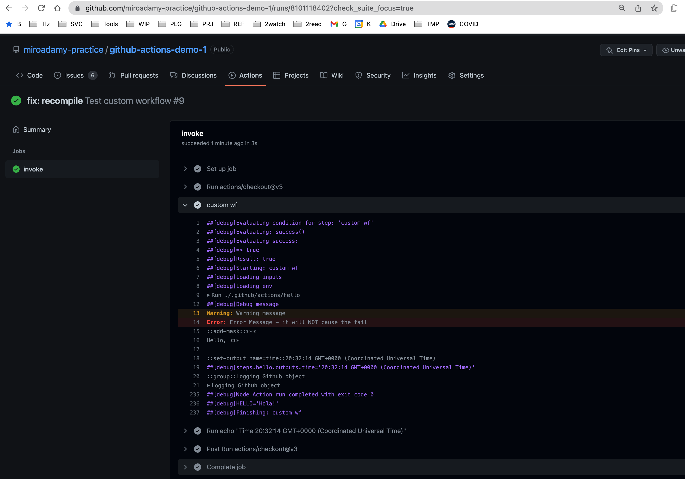

# 06 Creating own Github Actions

Instead of ugly long scripts we can use actions.

## 06-52 Github Actions Overview

Actions can:

* talk to 3rd party
* use GH API
* deploy code

If in public repo, can refer to them

Private actions: live in the same repo, use path

Actions can be written in Javascript (fastest)
or in any language inside Docker container => Linux only

Action can be referred:

* using branch name => actions/name@master => can break
* using commit sha => actions/name@7bf21e
* using tag (preferred) => actions/name@v1

We will re-create HelloJavascript action

## 06-53 Creating Simple JS Action

It will be private action => `./.github/actions/hello/`

Create the action.yml

```yml
name: Hello World
author: Miro
description: Following the course
inputs:
  whom-to-greet:
    description: "Whom to greet"
    required: true
    default: World
outputs:
  time:
    description: 'The greeting time'
runs:
  using: "node16"
  main: index.js

```

Create the `index.js`

```js
const core = require('@actions/core');
const githb = require('@actions/github');

// lets simulate an error => on GH action, it will seem to be successful
try {
    // throw( new Error('Some simulated error'));

    const name = core.getInput('whom-to-greet');
    console.log(`Hello, ${name}`);

    const time = new Date();
    core.setOutput("time", time.toTimeString());

    console.log.log(JSON.stringify(github, null, '\t'));
} catch (error) {}
    core.setFailed('I failed');
}
```

Need some packages:

```sh
➜  github-actions-demo-1 git:(custom-action-1) ✗ cd .github/actions/hello 


➜  hello git:(custom-action-1) ✗ npm list
env: node: No such file or directory

# need Node 16

➜  hello git:(custom-action-1) ✗ nvm use default
🚨 NVM not loaded! Loading now...
Now using node v16.13.1 (npm v8.3.1)

➜  hello git:(custom-action-1) ✗ npm list       
/Users/miroadamy/prj/MIRROR/github.com/miroadamy-practice/src/github-actions-demo-1/.github/actions/hello
└── (empty)

➜  hello git:(custom-action-1) ✗ npm install @actions/github --save

added 23 packages, and audited 24 packages in 6s

found 0 vulnerabilities

➜  hello git:(custom-action-1) ✗ npm install @actions/core --save  
⸨⠂⠂⠂⠂⠂⠂⠂⠂⠂⠂⠂⠂⠂⠂⠂⠂⠂⠂⸩ ⠴ idealTree:hello: sill idealTree buildDeps

added 2 packages, and audited 26 packages in 14s

found 0 vulnerabilities
➜  hello git:(custom-action-1) ✗ 

➜  hello git:(custom-action-1) ✗ npm list                        
hello@ /Users/miroadamy/prj/MIRROR/github.com/miroadamy-practice/src/github-actions-demo-1/.github/actions/hello
├── @actions/core@1.9.1
└── @actions/github@5.0.3

```

Adding test WF to invoke it:

```yaml
name: Test custom workflow
on:
  push:
    branches:
      - "custom-action*"

jobs:
  invoke:
    runs-on: ubuntu-latest
    steps:
      - uses: actions/checkout@v3
      - name: custom wf
        id: hello
        uses: ./.github/actions/hello
        with:
          whom-to-greet: 'Miro'
      - run: |
          echo "Time ${{ steps.hello.outputs.time}}"

```

When running these => does not find it, as they are not installed

```sh
node:internal/modules/cjs/loader:936
  throw err;
  ^

Error: Cannot find module '@actions/core'
Require stack:
- /home/runner/work/github-actions-demo-1/github-actions-demo-1/.github/actions/hello/index.js
    at Function.Module._resolveFilename (node:internal/modules/cjs/loader:933:15)
    at Function.Module._load (node:internal/modules/cjs/loader:778:27)
    at Module.require (node:internal/modules/cjs/loader:1005:19)
    at require (node:internal/modules/cjs/helpers:102:18)
    at Object.<anonymous> (/home/runner/work/github-actions-demo-1/github-actions-demo-1/.github/actions/hello/index.js:1:14)
    at Module._compile (node:internal/modules/cjs/loader:1101:14)
    at Object.Module._extensions..js (node:internal/modules/cjs/loader:1153:10)
    at Module.load (node:internal/modules/cjs/loader:981:32)
    at Function.Module._load (node:internal/modules/cjs/loader:822:12)
    at Function.executeUserEntryPoint [as runMain] (node:internal/modules/run_main:81:12) {
  code: 'MODULE_NOT_FOUND',
  requireStack: [
    '/home/runner/work/github-actions-demo-1/github-actions-demo-1/.github/actions/hello/index.js'
  ]
}

```

We need to bundle

## 06-54 - Bundling js code to one file

* using zeit/ncc

```sh
npm install -D @zeit/ncc
```

Use it

```sh
npx ncc build index.js -o dist
ncc: Version 0.22.3
ncc: Compiling file index.js
574kB  dist/index.js
574kB  [1092ms] - ncc 0.22.3

---
✗ ls -la dist
total 1152
drwxr-xr-x  3 miroadamy  staff      96 28 Aug 12:13 .
drwxr-xr-x  8 miroadamy  staff     256 28 Aug 12:13 ..
-rw-r--r--  1 miroadamy  staff  587355 28 Aug 12:13 index.js
➜  hello git:(custom-action-1) ✗ ls -la
total 64
drwxr-xr-x   8 miroadamy  staff    256 28 Aug 12:13 .
drwxr-xr-x   3 miroadamy  staff     96 25 Aug 21:48 ..
-rw-r--r--   1 miroadamy  staff    258 25 Aug 21:50 action.yml
drwxr-xr-x   3 miroadamy  staff     96 28 Aug 12:13 dist
-rw-r--r--   1 miroadamy  staff    484 25 Aug 23:33 index.js
drwxr-xr-x  19 miroadamy  staff    608 28 Aug 12:11 node_modules
-rw-r--r--   1 miroadamy  staff  18776 28 Aug 12:11 package-lock.json
-rw-r--r--   1 miroadamy  staff    146 28 Aug 12:11 package.json
```

Note the difference in size

After few typos and JS errors, it runs

!! Must ALWAYS execute the `npx ncc build index.js -o dist`

```json
Hello, Miro

{
 "context": {
  "payload": {
   "after": "c59b2ec4f43fba61416b2bf62c63bf0933856ffe",
   "base_ref": null,
   "before": "f81a378469ab3cdccf275c7358708b363995734b",
   "commits": [
    {
     "author": {
      "email": "miro.adamy@pivotree.com",
      "name": "Miro Adamy",
      "username": "miroadamy"
     },
     "committer": {
      "email": "miro.adamy@pivotree.com",
      "name": "Miro Adamy",
      "username": "miroadamy"
     },
     "distinct": true,
     "id": "c59b2ec4f43fba61416b2bf62c63bf0933856ffe",
     "message": "console.log.log is not a function",
     "timestamp": "2022-08-28T21:25:12+02:00",
     "tree_id": "9cfdfc5a5fd4144b4725099ec3bd93e8f6b78cff",
     "url": "https://github.com/miroadamy-practice/github-actions-demo-1/commit/c59b2ec4f43fba61416b2bf62c63bf0933856ffe"
    }
   ],
   "compare": "https://github.com/miroadamy-practice/github-actions-demo-1/compare/f81a378469ab...c59b2ec4f43f",
   "created": false,
   "deleted": false,
   "forced": false,
   "head_commit": {
    "author": {
     "email": "miro.adamy@pivotree.com",
     "name": "Miro Adamy",
     "username": "miroadamy"
    },
    "committer": {
     "email": "miro.adamy@pivotree.com",
     "name": "Miro Adamy",
     "username": "miroadamy"
    },
    "distinct": true,
    "id": "c59b2ec4f43fba61416b2bf62c63bf0933856ffe",
    "message": "console.log.log is not a function",
    "timestamp": "2022-08-28T21:25:12+02:00",
    "tree_id": "9cfdfc5a5fd4144b4725099ec3bd93e8f6b78cff",
    "url": "https://github.com/miroadamy-practice/github-actions-demo-1/commit/c59b2ec4f43fba61416b2bf62c63bf0933856ffe"
   },
   "organization": {
    "avatar_url": "https://avatars.githubusercontent.com/u/96669309?v=4",
    "description": null,
    "events_url": "https://api.github.com/orgs/miroadamy-practice/events",
    "hooks_url": "https://api.github.com/orgs/miroadamy-practice/hooks",
    "id": 96669309,
    "issues_url": "https://api.github.com/orgs/miroadamy-practice/issues",
    "login": "miroadamy-practice",
    "members_url": "https://api.github.com/orgs/miroadamy-practice/members{/member}",
    "node_id": "O_kgDOBcMOfQ",
    "public_members_url": "https://api.github.com/orgs/miroadamy-practice/public_members{/member}",
    "repos_url": "https://api.github.com/orgs/miroadamy-practice/repos",
    "url": "https://api.github.com/orgs/miroadamy-practice"
   },
   "pusher": {
    "email": "miro.adamy@gmail.com",
    "name": "miroadamy"
   },
   "ref": "refs/heads/custom-action-1",
   "repository": {
    "allow_forking": true,
    "archive_url": "https://api.github.com/repos/miroadamy-practice/github-actions-demo-1/{archive_format}{/ref}",
    "archived": false,
    "assignees_url": "https://api.github.com/repos/miroadamy-practice/github-actions-demo-1/assignees{/user}",
    "blobs_url": "https://api.github.com/repos/miroadamy-practice/github-actions-demo-1/git/blobs{/sha}",
    "branches_url": "https://api.github.com/repos/miroadamy-practice/github-actions-demo-1/branches{/branch}",
    "clone_url": "https://github.com/miroadamy-practice/github-actions-demo-1.git",
    "collaborators_url": "https://api.github.com/repos/miroadamy-practice/github-actions-demo-1/collaborators{/collaborator}",
    "comments_url": "https://api.github.com/repos/miroadamy-practice/github-actions-demo-1/comments{/number}",
    "commits_url": "https://api.github.com/repos/miroadamy-practice/github-actions-demo-1/commits{/sha}",
    "compare_url": "https://api.github.com/repos/miroadamy-practice/github-actions-demo-1/compare/{base}...{head}",
    "contents_url": "https://api.github.com/repos/miroadamy-practice/github-actions-demo-1/contents/{+path}",
    "contributors_url": "https://api.github.com/repos/miroadamy-practice/github-actions-demo-1/contributors",
    "created_at": 1659453264,
    "default_branch": "main",
    "deployments_url": "https://api.github.com/repos/miroadamy-practice/github-actions-demo-1/deployments",
    "description": null,
    "disabled": false,
    "downloads_url": "https://api.github.com/repos/miroadamy-practice/github-actions-demo-1/downloads",
    "events_url": "https://api.github.com/repos/miroadamy-practice/github-actions-demo-1/events",
    "fork": false,
    "forks": 0,
    "forks_count": 0,
    "forks_url": "https://api.github.com/repos/miroadamy-practice/github-actions-demo-1/forks",
    "full_name": "miroadamy-practice/github-actions-demo-1",
    "git_commits_url": "https://api.github.com/repos/miroadamy-practice/github-actions-demo-1/git/commits{/sha}",
    "git_refs_url": "https://api.github.com/repos/miroadamy-practice/github-actions-demo-1/git/refs{/sha}",
    "git_tags_url": "https://api.github.com/repos/miroadamy-practice/github-actions-demo-1/git/tags{/sha}",
    "git_url": "git://github.com/miroadamy-practice/github-actions-demo-1.git",
    "has_downloads": true,
    "has_issues": true,
    "has_pages": false,
    "has_projects": true,
    "has_wiki": true,
    "homepage": null,
    "hooks_url": "https://api.github.com/repos/miroadamy-practice/github-actions-demo-1/hooks",
    "html_url": "https://github.com/miroadamy-practice/github-actions-demo-1",
    "id": 520547627,
    "is_template": false,
    "issue_comment_url": "https://api.github.com/repos/miroadamy-practice/github-actions-demo-1/issues/comments{/number}",
    "issue_events_url": "https://api.github.com/repos/miroadamy-practice/github-actions-demo-1/issues/events{/number}",
    "issues_url": "https://api.github.com/repos/miroadamy-practice/github-actions-demo-1/issues{/number}",
    "keys_url": "https://api.github.com/repos/miroadamy-practice/github-actions-demo-1/keys{/key_id}",
    "labels_url": "https://api.github.com/repos/miroadamy-practice/github-actions-demo-1/labels{/name}",
    "language": "HTML",
    "languages_url": "https://api.github.com/repos/miroadamy-practice/github-actions-demo-1/languages",
    "license": {
     "key": "mit",
     "name": "MIT License",
     "node_id": "MDc6TGljZW5zZTEz",
     "spdx_id": "MIT",
     "url": "https://api.github.com/licenses/mit"
    },
    "master_branch": "main",
    "merges_url": "https://api.github.com/repos/miroadamy-practice/github-actions-demo-1/merges",
    "milestones_url": "https://api.github.com/repos/miroadamy-practice/github-actions-demo-1/milestones{/number}",
    "mirror_url": null,
    "name": "github-actions-demo-1",
    "node_id": "R_kgDOHwbtKw",
    "notifications_url": "https://api.github.com/repos/miroadamy-practice/github-actions-demo-1/notifications{?since,all,participating}",
    "open_issues": 6,
    "open_issues_count": 6,
    "organization": "miroadamy-practice",
    "owner": {
     "avatar_url": "https://avatars.githubusercontent.com/u/96669309?v=4",
     "email": null,
     "events_url": "https://api.github.com/users/miroadamy-practice/events{/privacy}",
     "followers_url": "https://api.github.com/users/miroadamy-practice/followers",
     "following_url": "https://api.github.com/users/miroadamy-practice/following{/other_user}",
     "gists_url": "https://api.github.com/users/miroadamy-practice/gists{/gist_id}",
     "gravatar_id": "",
     "html_url": "https://github.com/miroadamy-practice",
     "id": 96669309,
     "login": "miroadamy-practice",
     "name": "miroadamy-practice",
     "node_id": "O_kgDOBcMOfQ",
     "organizations_url": "https://api.github.com/users/miroadamy-practice/orgs",
     "received_events_url": "https://api.github.com/users/miroadamy-practice/received_events",
     "repos_url": "https://api.github.com/users/miroadamy-practice/repos",
     "site_admin": false,
     "starred_url": "https://api.github.com/users/miroadamy-practice/starred{/owner}{/repo}",
     "subscriptions_url": "https://api.github.com/users/miroadamy-practice/subscriptions",
     "type": "Organization",
     "url": "https://api.github.com/users/miroadamy-practice"
    },
    "private": false,
    "pulls_url": "https://api.github.com/repos/miroadamy-practice/github-actions-demo-1/pulls{/number}",
    "pushed_at": 1661714717,
    "releases_url": "https://api.github.com/repos/miroadamy-practice/github-actions-demo-1/releases{/id}",
    "size": 801,
    "ssh_url": "git@github.com:miroadamy-practice/github-actions-demo-1.git",
    "stargazers": 1,
    "stargazers_count": 1,
    "stargazers_url": "https://api.github.com/repos/miroadamy-practice/github-actions-demo-1/stargazers",
    "statuses_url": "https://api.github.com/repos/miroadamy-practice/github-actions-demo-1/statuses/{sha}",
    "subscribers_url": "https://api.github.com/repos/miroadamy-practice/github-actions-demo-1/subscribers",
    "subscription_url": "https://api.github.com/repos/miroadamy-practice/github-actions-demo-1/subscription",
    "svn_url": "https://github.com/miroadamy-practice/github-actions-demo-1",
    "tags_url": "https://api.github.com/repos/miroadamy-practice/github-actions-demo-1/tags",
    "teams_url": "https://api.github.com/repos/miroadamy-practice/github-actions-demo-1/teams",
    "topics": [],
    "trees_url": "https://api.github.com/repos/miroadamy-practice/github-actions-demo-1/git/trees{/sha}",
    "updated_at": "2022-08-26T12:12:23Z",
    "url": "https://github.com/miroadamy-practice/github-actions-demo-1",
    "visibility": "public",
    "watchers": 1,
    "watchers_count": 1,
    "web_commit_signoff_required": false
   },
   "sender": {
    "avatar_url": "https://avatars.githubusercontent.com/u/461826?v=4",
    "events_url": "https://api.github.com/users/miroadamy/events{/privacy}",
    "followers_url": "https://api.github.com/users/miroadamy/followers",
    "following_url": "https://api.github.com/users/miroadamy/following{/other_user}",
    "gists_url": "https://api.github.com/users/miroadamy/gists{/gist_id}",
    "gravatar_id": "",
    "html_url": "https://github.com/miroadamy",
    "id": 461826,
    "login": "miroadamy",
    "node_id": "MDQ6VXNlcjQ2MTgyNg==",
    "organizations_url": "https://api.github.com/users/miroadamy/orgs",
    "received_events_url": "https://api.github.com/users/miroadamy/received_events",
    "repos_url": "https://api.github.com/users/miroadamy/repos",
    "site_admin": false,
    "starred_url": "https://api.github.com/users/miroadamy/starred{/owner}{/repo}",
    "subscriptions_url": "https://api.github.com/users/miroadamy/subscriptions",
    "type": "User",
    "url": "https://api.github.com/users/miroadamy"
   }
  },
  "eventName": "push",
  "sha": "c59b2ec4f43fba61416b2bf62c63bf0933856ffe",
  "ref": "refs/heads/custom-action-1",
  "workflow": "Test custom workflow",
  "action": "hello",
  "actor": "miroadamy",
  "job": "invoke",
  "runNumber": 7,
  "runId": 2944247693,
  "apiUrl": "https://api.github.com",
  "serverUrl": "https://github.com",
  "graphqlUrl": "https://api.github.com/graphql"
 }
}
```

## 06-55 More about the @github/core package

See <https://github.com/actions/toolkit/tree/master/packages/core>

Enable debugging mode: set `ACTIONS_STEP_DEBUG=true`

Core can provide debug messages - the ^^ to see it

`core.debug('Debug message');`

`core.warning('Warning message');`

`core.error('Error Message - it will NOT cause the fail)`

See run - <https://github.com/miroadamy-practice/github-actions-demo-1/actions/runs/2959356905>

We can see the messages:




Note that:

* name is not logged
* Logging is collapsed for github
* the value of $HELLO is displayed
